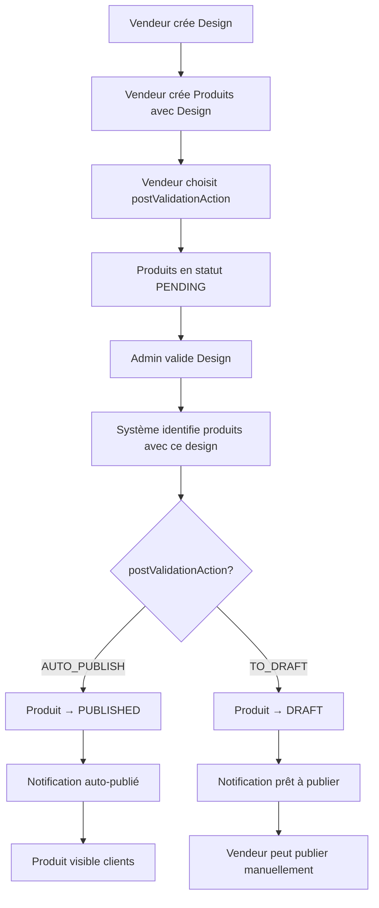

# 🎯 BACKEND — VALIDATION EN CASCADE DESIGN → PRODUITS

> **Guide d'implémentation** de la nouvelle logique de validation automatique des produits après validation du design

---

## 📋 Vue d'ensemble

### Problématique résolue
Avant cette implémentation, quand un admin validait un design, les produits qui utilisaient ce design restaient en attente de validation manuelle. Maintenant, **la validation du design déclenche automatiquement l'action choisie par le vendeur** sur tous les produits qui utilisent ce design.

### Nouveau workflow
1. **Vendeur** crée un design
2. **Vendeur** crée des produits avec ce design et choisit l'action post-validation :
   - `AUTO_PUBLISH` : Publication automatique après validation
   - `TO_DRAFT` : Mise en brouillon après validation (publication manuelle)
3. **Admin** valide le design
4. **Système** applique automatiquement l'action choisie sur tous les produits utilisant ce design

---

## 🔧 Implémentation technique

### 1. Modification du service Design

#### Méthode `validateDesign` modifiée
```typescript
// src/design/design.service.ts
async validateDesign(
  id: number, 
  adminId: number, 
  action: 'VALIDATE' | 'REJECT',
  rejectionReason?: string
): Promise<DesignResponseDto> {
  // ... validation existante ...

  // 🆕 NOUVELLE LOGIQUE: Si le design est validé, appliquer l'action sur tous les produits
  if (isApproved) {
    await this.applyValidationActionToProducts(existingDesign.imageUrl, existingDesign.vendorId, adminId);
  }

  // ... reste de la logique ...
}
```

#### Nouvelle méthode `applyValidationActionToProducts`
```typescript
private async applyValidationActionToProducts(designImageUrl: string, vendorId: number, adminId: number): Promise<void> {
  try {
    // Trouver tous les produits qui utilisent ce design
    const productsWithDesign = await this.prisma.vendorProduct.findMany({
      where: {
        vendorId: vendorId,
        designCloudinaryUrl: designImageUrl,
        status: 'PENDING' // Seulement les produits en attente
      },
      include: {
        vendor: {
          select: {
            id: true,
            firstName: true,
            lastName: true,
            email: true
          }
        }
      }
    });

    // Appliquer l'action choisie par le vendeur pour chaque produit
    for (const product of productsWithDesign) {
      const newStatus = product.postValidationAction === 'AUTO_PUBLISH' ? 'PUBLISHED' : 'DRAFT';
      
      await this.prisma.vendorProduct.update({
        where: { id: product.id },
        data: {
          status: newStatus,
          isValidated: true,
          validatedAt: new Date(),
          validatedBy: adminId,
          publishedAt: newStatus === 'PUBLISHED' ? new Date() : null,
          updatedAt: new Date()
        }
      });

      // Envoyer notification au vendeur selon l'action
      if (product.postValidationAction === 'AUTO_PUBLISH') {
        await this.notifyVendorProductAutoPublished(product);
      } else {
        await this.notifyVendorProductValidatedToDraft(product);
      }
    }
  } catch (error) {
    this.logger.error('❌ Erreur lors de l\'application de l\'action de validation:', error);
    throw error;
  }
}
```

### 2. Liaison Design ↔ Produits

#### Comment les produits sont liés aux designs
```typescript
// Les produits sont liés aux designs via l'URL Cloudinary
VendorProduct.designCloudinaryUrl === Design.imageUrl
```

#### Recherche des produits utilisant un design
```typescript
const productsWithDesign = await this.prisma.vendorProduct.findMany({
  where: {
    vendorId: vendorId,                    // Même vendeur
    designCloudinaryUrl: designImageUrl,  // Même URL design
    status: 'PENDING'                     // Seulement en attente
  }
});
```

### 3. Notifications automatiques

#### Notification produit auto-publié
```typescript
private async notifyVendorProductAutoPublished(product: any): Promise<void> {
  const subject = '🎉 Votre produit a été publié automatiquement - Printalma';
  const htmlContent = `
    <h2>🎉 Produit publié automatiquement !</h2>
    <p>Votre design a été validé et votre produit a été publié automatiquement.</p>
    <div>
      <h3>📦 Détails du produit</h3>
      <p><strong>Nom :</strong> ${product.name}</p>
      <p><strong>Prix :</strong> ${(product.price / 100).toFixed(2)}€</p>
      <p><strong>Statut :</strong> PUBLIÉ</p>
    </div>
  `;
  
  await this.mailService.sendEmail(product.vendor.email, subject, htmlContent);
}
```

#### Notification produit validé en brouillon
```typescript
private async notifyVendorProductValidatedToDraft(product: any): Promise<void> {
  const subject = '✅ Votre produit a été validé - Prêt à publier - Printalma';
  const htmlContent = `
    <h2>✅ Produit validé et prêt à publier !</h2>
    <p>Votre design a été validé et votre produit a été mis en brouillon.</p>
    <p>Vous pouvez maintenant le publier quand vous le souhaitez.</p>
  `;
  
  await this.mailService.sendEmail(product.vendor.email, subject, htmlContent);
}
```

---

## 🔄 Flux de données complet

### Schéma du processus



### États des produits

| État initial | Action vendeur | Après validation design | Notification |
|-------------|----------------|------------------------|--------------|
| `PENDING` | `AUTO_PUBLISH` | `PUBLISHED` | 🎉 Auto-publié |
| `PENDING` | `TO_DRAFT` | `DRAFT` (validé) | ✅ Prêt à publier |

---

## 🧪 Tests et validation

### Script de test
```bash
# Exécuter le test de validation en cascade
node test-design-validation-cascade.js
```

### Scénarios testés
1. **Création vendeur et design**
2. **Création produits avec actions différentes**
3. **Validation design par admin**
4. **Vérification cascade automatique**
5. **Contrôle notifications**

### Résultats attendus
- ✅ Produit `AUTO_PUBLISH` → `PUBLISHED`
- ✅ Produit `TO_DRAFT` → `DRAFT` (validé)
- ✅ Notifications envoyées
- ✅ Logs de traçabilité

---

## 📊 Avantages de cette approche

### Pour les vendeurs
- **Automatisation** : Plus besoin d'attendre une validation manuelle de chaque produit
- **Flexibilité** : Choix de l'action selon leurs besoins
- **Transparence** : Notifications claires à chaque étape

### Pour les admins
- **Efficacité** : Une seule validation de design traite tous les produits associés
- **Cohérence** : Tous les produits utilisant un design validé sont traités uniformément
- **Traçabilité** : Logs détaillés de chaque action

### Pour le système
- **Performance** : Réduction des validations manuelles
- **Consistance** : Logique centralisée de validation
- **Évolutivité** : Facilement extensible pour d'autres actions

---

## 🚀 Déploiement

### Étapes de déploiement
1. **Backup base de données**
2. **Déployer le code modifié**
3. **Tester avec données réelles**
4. **Monitorer les logs**
5. **Valider les notifications**

### Points de surveillance
- **Performances** : Temps de traitement de la cascade
- **Erreurs** : Logs d'erreurs dans `applyValidationActionToProducts`
- **Notifications** : Taux de livraison des emails
- **Cohérence** : Vérification états produits vs designs

---

## 📝 Logs et debugging

### Logs importants
```typescript
// Début de cascade
this.logger.log(`🔄 Application de l'action de validation sur ${productsWithDesign.length} produits`);

// Traitement individuel
this.logger.log(`✅ Produit ${product.id} ${newStatus === 'PUBLISHED' ? 'publié automatiquement' : 'mis en brouillon'}`);

// Fin de cascade
this.logger.log(`🎉 ${productsWithDesign.length} produits traités avec succès`);
```

### Debugging en cas d'erreur
```bash
# Vérifier les logs du serveur
tail -f logs/application.log | grep "cascade\|validation"

# Vérifier état des produits
SELECT id, status, isValidated, postValidationAction, designCloudinaryUrl 
FROM VendorProduct 
WHERE designCloudinaryUrl = 'URL_DU_DESIGN';
```

---

## 🔮 Évolutions futures

### Améliorations possibles
1. **Validation par lot** : Traiter plusieurs designs simultanément
2. **Rollback automatique** : Annuler la cascade en cas d'erreur
3. **Notifications push** : Notifications temps réel via WebSocket
4. **Analytics** : Statistiques sur les cascades de validation

### Extensibilité
- **Nouvelles actions** : Ajouter d'autres types d'actions post-validation
- **Conditions** : Validation conditionnelle selon critères
- **Intégrations** : Webhooks vers systèmes externes

---

**🎉 La validation en cascade est maintenant pleinement opérationnelle !**

Cette implémentation améliore significativement l'expérience utilisateur en automatisant le processus de validation des produits après validation du design, tout en conservant la flexibilité pour les vendeurs de choisir leur stratégie de publication. 
 