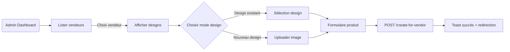

# 🖥️ Guide Frontend – Création de Produits Vendeur (Admin)

## 1. Présentation
Ce guide explique comment consommer les endpoints backend permettant aux administrateurs **Printalma** de :
1. Lister les vendeurs
2. Consulter leurs designs
3. Créer un produit au nom d’un vendeur en :
   • réutilisant un design existant **ou**
   • créant un nouveau design (upload base64)

Le tout s’appuie sur la nouvelle architecture V2 (productStructure, designApplication, selectedColors, etc.).

---

## 2. Pré-requis
• **Token JWT Admin** → obtenu via `/auth/login`
• Librairie HTTP (ex. `axios`)
• Framework (React, Vue, Angular) au choix
• Support d’upload **base64** → `FileReader`, `canvas` ou équivalent  

---

## 3. Endpoints Résumés
| Action | Méthode | URL | Auth |
|--------|---------|-----|------|
| Liste vendeurs | GET | `/vendor-product-validation/vendors` | Admin |
| Designs d’un vendeur | GET | `/vendor-product-validation/vendors/:vendorId/designs?limit=&offset=&status=` | Admin |
| Créer produit pour vendeur | POST | `/vendor-product-validation/create-for-vendor` | Admin |
| Lister tous les produits (vérif) | GET | `/vendor-product-validation/all-products?...` | Admin |

---

## 4. Flux UI recommandé


---

## 5. Exemple de Code (React + axios)
```tsx
// services/adminProductService.ts
import axios from 'axios';

const api = axios.create({
  baseURL: process.env.REACT_APP_API_BASE_URL,
});

// Injecte automatiquement le token admin
api.interceptors.request.use((config) => {
  const token = localStorage.getItem('adminToken');
  if (token) config.headers.Authorization = `Bearer ${token}`;
  return config;
});

export const fetchVendors = () => api.get('/vendor-product-validation/vendors');
export const fetchVendorDesigns = (vendorId: number, params?: any) =>
  api.get(`/vendor-product-validation/vendors/${vendorId}/designs`, { params });

export const createProductForVendor = (payload: any) =>
  api.post('/vendor-product-validation/create-for-vendor', payload);
```

### 5.1. Récupération des vendeurs
```tsx
// VendorsPage.tsx
useEffect(() => {
  fetchVendors().then(({ data }) => setVendors(data.vendors));
}, []);
```

### 5.2. Préparer un nouveau design (base64)
```tsx
function fileToBase64(file: File): Promise<string> {
  return new Promise((res, rej) => {
    const reader = new FileReader();
    reader.onload = () => res(reader.result as string);
    reader.onerror = rej;
    reader.readAsDataURL(file);
  });
}
```

### 5.3. Création – Mode Design Existant
```tsx
const payloadExisting = {
  vendorId: vendor.id,
  designId: selectedDesign.id,
  baseProductId: baseProduct.id,
  productStructure,
  vendorPrice: 2500,
  vendorName: 'T-shirt Dragon',
  vendorDescription: 'Super t-shirt',
  vendorStock: 100,
  selectedColors,
  selectedSizes,
  forcedStatus: 'DRAFT',
  postValidationAction: 'AUTO_PUBLISH',
  designPosition: { x: 0, y: 0, scale: 0.75, rotation: 0 },
};

await createProductForVendor(payloadExisting);
```

### 5.4. Création – Mode Nouveau Design
```tsx
const base64 = await fileToBase64(file);

const payloadNew = {
  vendorId: vendor.id,
  baseProductId: baseProduct.id,
  newDesign: {
    name: form.designName,
    description: form.designDesc,
    category: form.category, // LOGO | PATTERN | …
    imageBase64: base64,
    tags: form.tags.split(',').map((t) => t.trim()),
  },
  productStructure,
  vendorPrice: 2800,
  vendorName: 'T-shirt Perso',
  vendorDescription: 'Créé depuis le dashboard',
  vendorStock: 25,
  selectedColors,
  selectedSizes,
  forcedStatus: 'PENDING', // car design nouveau
  postValidationAction: 'TO_DRAFT',
};

await createProductForVendor(payloadNew);
```

---

## 6. Structure `productStructure`
```ts
interface ProductStructure {
  adminProduct: {
    id: number;
    name: string;
    description: string;
    price: number; // cents
    images: {
      colorVariations: Array<{
        id: number;
        name: string;
        colorCode: string;
        images: Array<{
          id: number;
          url: string;
          viewType: 'FRONT' | 'BACK' | string;
          delimitations: Array<{ x: number; y: number; width: number; height: number; coordinateType: 'PERCENTAGE' | 'ABSOLUTE' }>;
        }>;
      }>;
    };
    sizes: Array<{ id: number; sizeName: string }>;
  };
  designApplication: {
    positioning: 'CENTER'; // futures valeurs possibles (LEFT, RIGHT…)
    scale: number; // 0-1
  };
}
```

---

## 7. Gestion des Erreurs
| Code | Scénario | Message |
|------|----------|---------|
| 400 | `designId` & `newDesign` fournis | "Vous ne pouvez pas fournir à la fois…" |
| 400 | Aucun design fourni | "Vous devez fournir soit un designId…" |
| 404 | Vendeur/design/produit de base introuvable | Texte explicite |
| 403 | Token non-admin | "Accès refusé" |

Affichez un toast, modal ou banner d’erreur selon votre design system.

---

## 8. Helpers UX
1. **ProgressBar Upload** : pendant l’envoi du base64 (utiliser `onUploadProgress`)  
2. **Preview Design** : afficher le base64 dans un `` avant envoi  
3. **Select Colors** : UI listant `baseProduct.colorVariations`  
4. **Select Sizes** : UI listant `baseProduct.sizes`  
5. **Position Picker (optionnel)** : sauvegarder `designPosition` depuis un canvas interactif

---

## 9. Vérification Post-Création
Après un `201`, vous recevez :
```json
{
  "productId": 456,
  "status": "DRAFT|PENDING|PUBLISHED",
  "newDesignCreated": true|false,
  "designId": 78,
  "designUrl": "https://res.cloudinary.com/..."
}
```
• Redirigez vers une page détail produit admin _ou_ liste produits.  
• Si `status === 'PENDING'` → ajoutez un badge « En attente de validation ».

---

## 10. Tips Performance
• Stocker la liste vendeurs en cache (SWC / React-Query)  
• Débouncer la recherche dans `/all-products`  
• Lazy-load preview designs (IntersectionObserver)

---

## 11. Roadmap UI (suggestion)
1. **Table Vendors** → sélection + bouton « Créer produit »  
2. **Modal Choose Design** → existant ou upload  
3. **Drawer Product Form** → détails produit  
4. **Snackbar Résultat**  
5. **Page Produits Vendeur** (filtrable)  
6. **Review Validation Admin** (badge + actions)

---

## 12. Conclusion
Vous disposez désormais de toutes les informations pour intégrer la création de produits vendeur via le dashboard admin.  
N’hésitez pas à consulter la documentation Swagger intégrée (http://localhost:3000/api) pour les schémas détaillés.

**Happy Coding 👩‍💻👨‍💻 !** 