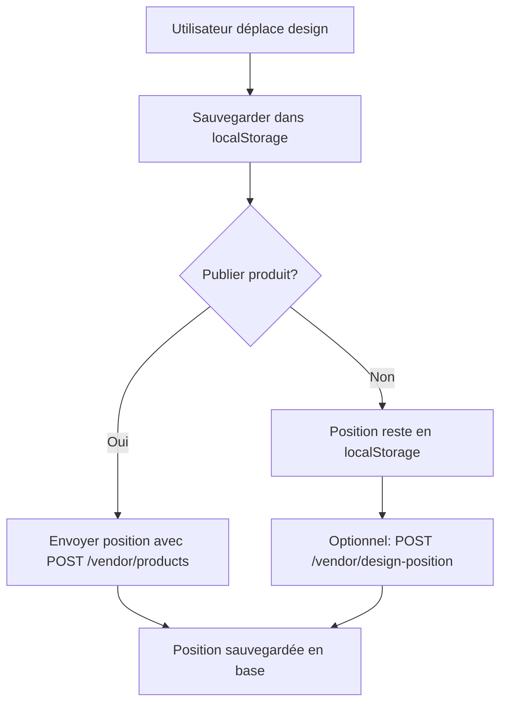

# 📍 Guide Frontend : Gestion des Positions Design avec localStorage

## 🎯 Objectif

Ce guide explique comment gérer les positions/transformations des designs en utilisant le **localStorage** côté frontend, puis les synchroniser avec le backend lors de la publication.

---

## 🔧 Architecture

### Workflow complet


### Avantages localStorage
- ✅ **Performance** : Pas de requête réseau à chaque mouvement
- ✅ **Persistance** : Positions conservées entre sessions
- ✅ **Flexibilité** : Sauvegarde quand l'utilisateur le souhaite
- ✅ **Offline** : Fonctionne sans connexion

---

## 💾 Structure localStorage

### Clé de stockage
```javascript
const STORAGE_KEY = 'printalma_design_positions';
```

### Format des données
```javascript
{
  "design_42_product_12": {
    "designId": 42,
    "vendorProductId": 12,
    "position": {
      "x": -44,
      "y": -68,
      "scale": 0.44166666666666665,
      "rotation": 15
    },
    "lastModified": "2025-01-09T10:30:00.000Z"
  },
  "design_15_product_8": {
    "designId": 15,
    "vendorProductId": 8,
    "position": {
      "x": 0,
      "y": 0,
      "scale": 1,
      "rotation": 0
    },
    "lastModified": "2025-01-09T09:15:00.000Z"
  }
}
```

---

## 🔨 Implémentation Frontend

### 1. Service de gestion localStorage

```javascript
// services/DesignPositionService.js
class DesignPositionService {
  constructor() {
    this.STORAGE_KEY = 'printalma_design_positions';
  }

  /**
   * Générer une clé unique pour un couple design/produit
   */
  generateKey(designId, vendorProductId) {
    return `design_${designId}_product_${vendorProductId}`;
  }

  /**
   * Sauvegarder une position dans localStorage
   */
  savePosition(designId, vendorProductId, position) {
    try {
      const positions = this.getAllPositions();
      const key = this.generateKey(designId, vendorProductId);
      
      positions[key] = {
        designId,
        vendorProductId,
        position: {
          x: position.x,
          y: position.y,
          scale: position.scale || 1,
          rotation: position.rotation || 0
        },
        lastModified: new Date().toISOString()
      };
      
      localStorage.setItem(this.STORAGE_KEY, JSON.stringify(positions));
      console.log('✅ Position sauvegardée en localStorage:', key);
      
      return true;
    } catch (error) {
      console.error('❌ Erreur sauvegarde localStorage:', error);
      return false;
    }
  }

  /**
   * Récupérer une position depuis localStorage
   */
  getPosition(designId, vendorProductId) {
    try {
      const positions = this.getAllPositions();
      const key = this.generateKey(designId, vendorProductId);
      
      return positions[key] || null;
    } catch (error) {
      console.error('❌ Erreur récupération localStorage:', error);
      return null;
    }
  }

  /**
   * Récupérer toutes les positions
   */
  getAllPositions() {
    try {
      const stored = localStorage.getItem(this.STORAGE_KEY);
      return stored ? JSON.parse(stored) : {};
    } catch (error) {
      console.error('❌ Erreur parsing localStorage:', error);
      return {};
    }
  }

  /**
   * Supprimer une position
   */
  removePosition(designId, vendorProductId) {
    try {
      const positions = this.getAllPositions();
      const key = this.generateKey(designId, vendorProductId);
      
      delete positions[key];
      localStorage.setItem(this.STORAGE_KEY, JSON.stringify(positions));
      
      return true;
    } catch (error) {
      console.error('❌ Erreur suppression localStorage:', error);
      return false;
    }
  }

  /**
   * Vider toutes les positions
   */
  clearAllPositions() {
    try {
      localStorage.removeItem(this.STORAGE_KEY);
      return true;
    } catch (error) {
      console.error('❌ Erreur vidage localStorage:', error);
      return false;
    }
  }
}

export default new DesignPositionService();
```

### 2. Composant d'édition design

```javascript
// components/DesignEditor.jsx
import React, { useState, useEffect } from 'react';
import DesignPositionService from '../services/DesignPositionService';

const DesignEditor = ({ designId, vendorProductId, onPositionChange }) => {
  const [position, setPosition] = useState({
    x: 0,
    y: 0,
    scale: 1,
    rotation: 0
  });

  // Charger la position depuis localStorage au montage
  useEffect(() => {
    const savedPosition = DesignPositionService.getPosition(designId, vendorProductId);
    if (savedPosition) {
      setPosition(savedPosition.position);
      console.log('✅ Position chargée depuis localStorage:', savedPosition);
    }
  }, [designId, vendorProductId]);

  // Sauvegarder la position lors des changements
  const handlePositionChange = (newPosition) => {
    setPosition(newPosition);
    
    // Sauvegarder immédiatement en localStorage
    DesignPositionService.savePosition(designId, vendorProductId, newPosition);
    
    // Notifier le parent si nécessaire
    if (onPositionChange) {
      onPositionChange(newPosition);
    }
  };

  // Gestionnaires d'événements
  const handleDrag = (deltaX, deltaY) => {
    const newPosition = {
      ...position,
      x: position.x + deltaX,
      y: position.y + deltaY
    };
    handlePositionChange(newPosition);
  };

  const handleScale = (newScale) => {
    const newPosition = {
      ...position,
      scale: newScale
    };
    handlePositionChange(newPosition);
  };

  const handleRotation = (newRotation) => {
    const newPosition = {
      ...position,
      rotation: newRotation
    };
    handlePositionChange(newPosition);
  };

  return (
    <div className="design-editor">
      <div 
        className="design-container"
        style={{
          transform: `translate(${position.x}px, ${position.y}px) scale(${position.scale}) rotate(${position.rotation}deg)`
        }}
      >
        {/* Votre design ici */}
      </div>
      
      <div className="controls">
        <input 
          type="range" 
          min="0.1" 
          max="2" 
          step="0.1" 
          value={position.scale}
          onChange={(e) => handleScale(parseFloat(e.target.value))}
        />
        <input 
          type="range" 
          min="0" 
          max="360" 
          value={position.rotation}
          onChange={(e) => handleRotation(parseInt(e.target.value))}
        />
      </div>
    </div>
  );
};

export default DesignEditor;
```

### 3. Service API

```javascript
// services/ApiService.js
import axios from 'axios';

const API_BASE = 'http://localhost:3004';

const axiosConfig = {
  withCredentials: true,
  headers: {
    'Content-Type': 'application/json'
  }
};

class ApiService {
  /**
   * Créer un produit avec position depuis localStorage
   */
  async createProductWithPosition(productData, designPosition) {
    try {
      const payload = {
        ...productData,
        // ✅ NOUVELLE FONCTIONNALITÉ: Position depuis localStorage
        designPosition: designPosition || null
      };

      const response = await axios.post(`${API_BASE}/vendor/products`, payload, axiosConfig);
      return response.data;
    } catch (error) {
      console.error('❌ Erreur création produit:', error);
      throw error;
    }
  }

  /**
   * Sauvegarder une position spécifique (optionnel)
   */
  async saveDesignPosition(vendorProductId, designId, position) {
    try {
      const payload = {
        vendorProductId,
        designId,
        position
      };

      const response = await axios.post(`${API_BASE}/vendor/design-position`, payload, axiosConfig);
      return response.data;
    } catch (error) {
      console.error('❌ Erreur sauvegarde position:', error);
      throw error;
    }
  }

  /**
   * Sauvegarder transforms (ancien système, toujours supporté)
   */
  async saveDesignTransforms(vendorProductId, designUrl, transforms) {
    try {
      const payload = {
        vendorProductId,
        designUrl,
        transforms,
        lastModified: Date.now()
      };

      const response = await axios.post(`${API_BASE}/vendor/design-transforms/save`, payload, axiosConfig);
      return response.data;
    } catch (error) {
      console.error('❌ Erreur sauvegarde transforms:', error);
      throw error;
    }
  }
}

export default new ApiService();
```

### 4. Hook personnalisé

```javascript
// hooks/useDesignPosition.js
import { useState, useEffect } from 'react';
import DesignPositionService from '../services/DesignPositionService';

export const useDesignPosition = (designId, vendorProductId) => {
  const [position, setPosition] = useState({
    x: 0,
    y: 0,
    scale: 1,
    rotation: 0
  });

  // Charger depuis localStorage
  useEffect(() => {
    const savedPosition = DesignPositionService.getPosition(designId, vendorProductId);
    if (savedPosition) {
      setPosition(savedPosition.position);
    }
  }, [designId, vendorProductId]);

  // Sauvegarder en localStorage
  const savePosition = (newPosition) => {
    setPosition(newPosition);
    return DesignPositionService.savePosition(designId, vendorProductId, newPosition);
  };

  // Récupérer la position pour l'API
  const getPositionForApi = () => {
    return DesignPositionService.getPosition(designId, vendorProductId);
  };

  return {
    position,
    savePosition,
    getPositionForApi
  };
};
```

---

## 🚀 Utilisation pratique

### Exemple complet : Création de produit

```javascript
// components/ProductCreationForm.jsx
import React, { useState } from 'react';
import { useDesignPosition } from '../hooks/useDesignPosition';
import ApiService from '../services/ApiService';

const ProductCreationForm = ({ designId }) => {
  const [productData, setProductData] = useState({
    baseProductId: 4,
    designId: designId,
    vendorName: '',
    vendorDescription: '',
    vendorPrice: 25000,
    vendorStock: 100,
    selectedColors: [],
    selectedSizes: [],
    productStructure: {
      adminProduct: {
        name: 'T-shirt Basique',
        description: 'T-shirt en coton',
        price: 15000
      },
      designApplication: {
        scale: 0.6
      }
    }
  });

  const { position, getPositionForApi } = useDesignPosition(designId, null);

  const handleSubmit = async (e) => {
    e.preventDefault();
    
    try {
      // Récupérer la position depuis localStorage
      const savedPosition = getPositionForApi();
      const designPosition = savedPosition ? savedPosition.position : null;

      // Créer le produit avec la position
      const result = await ApiService.createProductWithPosition(productData, designPosition);
      
      if (result.success) {
        console.log('✅ Produit créé avec position:', result.data.vendorProduct.id);
        // Rediriger ou afficher succès
      }
    } catch (error) {
      console.error('❌ Erreur création produit:', error);
    }
  };

  return (
    <form onSubmit={handleSubmit}>
      {/* Vos champs de formulaire */}
      
      <div className="position-preview">
        <h3>Position actuelle du design</h3>
        <p>X: {position.x}, Y: {position.y}</p>
        <p>Scale: {position.scale}, Rotation: {position.rotation}°</p>
      </div>
      
      <button type="submit">Créer le produit</button>
    </form>
  );
};

export default ProductCreationForm;
```

---

## 🔄 Synchronisation avec le backend

### Stratégies de synchronisation

#### 1. Synchronisation lors de la publication (recommandé)
```javascript
// Envoyer la position avec POST /vendor/products
const createProduct = async (productData, designId, vendorProductId) => {
  const savedPosition = DesignPositionService.getPosition(designId, vendorProductId);
  
  const payload = {
    ...productData,
    designPosition: savedPosition ? savedPosition.position : null
  };
  
  return await ApiService.createProductWithPosition(payload);
};
```

#### 2. Synchronisation en temps réel (optionnel)
```javascript
// Envoyer immédiatement après chaque changement
const handlePositionChange = async (newPosition) => {
  // Sauvegarder en localStorage
  DesignPositionService.savePosition(designId, vendorProductId, newPosition);
  
  // Envoyer au backend si le produit existe
  if (vendorProductId) {
    try {
      await ApiService.saveDesignPosition(vendorProductId, designId, newPosition);
    } catch (error) {
      console.warn('⚠️ Erreur sync backend, position gardée en localStorage');
    }
  }
};
```

#### 3. Synchronisation batch (pour performance)
```javascript
// Synchroniser plusieurs positions à la fois
const syncAllPendingPositions = async () => {
  const positions = DesignPositionService.getAllPositions();
  
  for (const [key, data] of Object.entries(positions)) {
    try {
      await ApiService.saveDesignPosition(
        data.vendorProductId,
        data.designId,
        data.position
      );
      console.log(`✅ Position synchronisée: ${key}`);
    } catch (error) {
      console.error(`❌ Erreur sync ${key}:`, error);
    }
  }
};
```

---

## 🛠️ Endpoints API

### 1. Créer produit avec position
```javascript
POST /vendor/products
{
  "baseProductId": 4,
  "designId": 42,
  "vendorName": "Mon Produit",
  "vendorPrice": 25000,
  // ... autres champs
  "designPosition": {
    "x": -44,
    "y": -68,
    "scale": 0.44,
    "rotation": 15
  }
}
```

### 2. Sauvegarder position spécifique
```javascript
POST /vendor/design-position
{
  "vendorProductId": 12,
  "designId": 42,
  "position": {
    "x": -44,
    "y": -68,
    "scale": 0.44,
    "rotation": 15
  }
}
```

### 3. Sauvegarder transforms (legacy)
```javascript
POST /vendor/design-transforms/save
{
  "vendorProductId": 12,
  "designUrl": "https://res.cloudinary.com/...",
  "transforms": {
    "0": {
      "x": -44,
      "y": -68,
      "scale": 0.44,
      "rotation": 15
    }
  },
  "lastModified": 1736420184324
}
```

---

## 🧪 Tests recommandés

### Test localStorage
```javascript
// Test de base
const testLocalStorage = () => {
  const designId = 42;
  const vendorProductId = 12;
  const position = { x: 10, y: 20, scale: 0.8, rotation: 45 };
  
  // Sauvegarder
  DesignPositionService.savePosition(designId, vendorProductId, position);
  
  // Récupérer
  const retrieved = DesignPositionService.getPosition(designId, vendorProductId);
  
  console.assert(retrieved.position.x === 10, 'Position X incorrecte');
  console.assert(retrieved.position.y === 20, 'Position Y incorrecte');
  console.log('✅ Test localStorage réussi');
};
```

### Test API
```javascript
// Test création produit avec position
const testProductCreation = async () => {
  const productData = {
    baseProductId: 4,
    designId: 42,
    vendorName: 'Test Position',
    // ... autres champs
    designPosition: {
      x: -50,
      y: -70,
      scale: 0.5,
      rotation: 20
    }
  };
  
  try {
    const result = await ApiService.createProductWithPosition(productData);
    console.log('✅ Produit créé avec position:', result);
  } catch (error) {
    console.error('❌ Erreur test:', error);
  }
};
```

---

## 📋 Checklist d'implémentation

### Phase 1 : localStorage
- [ ] Créer le service `DesignPositionService`
- [ ] Implémenter sauvegarde/récupération positions
- [ ] Tester persistance entre sessions
- [ ] Gérer les erreurs localStorage

### Phase 2 : Interface utilisateur
- [ ] Modifier composant d'édition design
- [ ] Charger positions depuis localStorage
- [ ] Sauvegarder à chaque changement
- [ ] Afficher position actuelle

### Phase 3 : API Integration
- [ ] Modifier formulaire création produit
- [ ] Envoyer position avec `POST /vendor/products`
- [ ] Implémenter sauvegarde optionnelle `POST /vendor/design-position`
- [ ] Gérer erreurs réseau

### Phase 4 : Tests
- [ ] Tester localStorage
- [ ] Tester création produit avec position
- [ ] Tester synchronisation backend
- [ ] Tester cas d'erreur

---

## 🎯 Résultat attendu

Après implémentation, votre frontend pourra :

1. **Sauvegarder** les positions en localStorage en temps réel
2. **Persister** les positions entre sessions
3. **Synchroniser** avec le backend lors de la publication
4. **Récupérer** les positions pour l'affichage
5. **Gérer** les erreurs gracieusement

**Performance** : Plus de requêtes réseau à chaque mouvement !  
**Fiabilité** : Positions conservées même en cas de problème réseau !  
**Expérience** : Interface fluide et réactive !

---

**Prêt à implémenter ? Commencez par le service localStorage puis intégrez progressivement dans vos composants !** 🚀 