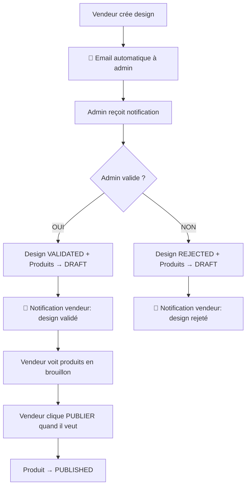

# Guide Frontend : Nouvelle Logique de Validation Design ➜ Produits

## 📋 Contexte - NOUVELLE LOGIQUE (Décembre 2024)

Depuis la dernière mise à jour, la logique de validation a été **complètement modifiée** pour donner plus de contrôle aux vendeurs :

### 🔄 Nouveau Workflow

1. **Vendeur crée un design** → 📧 **Admin reçoit un email automatiquement** avec toutes les infos
2. **Admin valide le design** → tous les produits associés passent en `DRAFT` (brouillon)
3. **Le vendeur décide** quand publier ses produits (de `DRAFT` à `PUBLISHED`)

### ⚡ Changements par rapport à l'ancien système

| Étape | Ancienne logique | 🆕 Nouvelle logique |
|-------|------------------|-------------------|
| Création design | Pas d'email immédiat | 📧 Email automatique à l'admin |
| Validation admin | Produits → `PUBLISHED` | Produits → `DRAFT` |
| Publication | Automatique | 👤 Manuelle par le vendeur |

---

## 🧩 Détails backend

### Nouveaux endpoints
* **Création design** : `POST /api/designs` → email automatique aux admins
* **Publication produit** : `PUT /api/vendor-publish/products/:id/publish` (nouveau)
* **Validation admin** : `PUT /api/designs/:id/validate` (logique modifiée)

### Cascade modifiée
```ts
// Dans validateDesign() - src/design/design.service.ts
if (isApproved) {
  await prisma.vendorProduct.updateMany({
    where: { designId: id },
    data: {
      status: PublicationStatus.DRAFT, // 🔄 CHANGÉ: DRAFT au lieu de PUBLISHED
      isValidated: true,
      // ... autres champs
    },
  });
}
```

---

## 🚀 Impact côté Frontend

### 1. **Nouvelles interfaces nécessaires**

```tsx
// Interface pour l'action de publication manuelle
interface PublishProductResponse {
  success: boolean;
  message: string;
  product: any;
}

// États des produits à gérer
type ProductStatus = 'DRAFT' | 'PENDING' | 'PUBLISHED';
type DesignValidationStatus = 'PENDING' | 'VALIDATED' | 'REJECTED';
```

### 2. **Nouveaux écrans/composants à créer**

- **Page vendeur : "Mes produits en brouillon"** (nouveaux produits validés mais non publiés)
- **Bouton "Publier" sur chaque produit DRAFT**
- **Interface admin : notification email de nouveaux designs**

### 3. **Modifications des listes existantes**

Les produits validés n'apparaissent plus automatiquement dans "Mes produits publiés" - ils restent en "brouillon" jusqu'à action du vendeur.

---

## 💻 Exemples de code

### Publier un produit manuellement

```tsx
const publishProduct = async (productId: number) => {
  try {
    const response = await fetch(`/api/vendor-publish/products/${productId}/publish`, {
      method: 'PUT',
      headers: { 
        'Authorization': `Bearer ${token}`,
        'Content-Type': 'application/json'
      }
    });
    
    const result = await response.json();
    
    if (result.success) {
      toast.success(result.message);
      // Réactualiser les listes
      mutate(keyDraftProducts);
      mutate(keyPublishedProducts);
    } else {
      toast.error('Erreur lors de la publication');
    }
  } catch (error) {
    toast.error('Impossible de publier le produit');
  }
};
```

### Composant bouton de publication

```tsx
const PublishButton = ({ product }: { product: VendorProduct }) => {
  const [isPublishing, setIsPublishing] = useState(false);
  
  const handlePublish = async () => {
    setIsPublishing(true);
    try {
      await publishProduct(product.id);
    } finally {
      setIsPublishing(false);
    }
  };
  
  // Vérifier si le produit peut être publié
  const canPublish = product.status === 'DRAFT' && 
                    product.design?.validationStatus === 'VALIDATED';
  
  if (!canPublish) return null;
  
  return (
    <button 
      onClick={handlePublish}
      disabled={isPublishing}
      className="btn btn-success"
    >
      {isPublishing ? '⏳ Publication...' : '📢 Publier maintenant'}
    </button>
  );
};
```

### Gestion des statuts dans les listes

```tsx
const ProductsList = () => {
  const [filter, setFilter] = useState<'all' | 'draft' | 'published' | 'pending'>('all');
  
  const filteredProducts = products.filter(product => {
    switch (filter) {
      case 'draft':
        return product.status === 'DRAFT';
      case 'published':
        return product.status === 'PUBLISHED';
      case 'pending':
        return product.status === 'PENDING';
      default:
        return true;
    }
  });
  
  return (
    <div>
      <div className="filter-tabs">
        <button onClick={() => setFilter('draft')} className={filter === 'draft' ? 'active' : ''}>
          📝 Brouillons ({products.filter(p => p.status === 'DRAFT').length})
        </button>
        <button onClick={() => setFilter('published')} className={filter === 'published' ? 'active' : ''}>
          ✅ Publiés ({products.filter(p => p.status === 'PUBLISHED').length})
        </button>
        <button onClick={() => setFilter('pending')} className={filter === 'pending' ? 'active' : ''}>
          ⏳ En attente ({products.filter(p => p.status === 'PENDING').length})
        </button>
      </div>
      
      {filteredProducts.map(product => (
        <ProductCard key={product.id} product={product} />
      ))}
    </div>
  );
};
```

---

## 🔄 Flow complet mis à jour



---

## 🛠️ Points d'attention

1. **Produits orphelins** : les produits validés restent en DRAFT jusqu'à action manuelle
2. **Email template** : nouveau template `design-creation-notification` pour les admins
3. **UX** : expliquer clairement aux vendeurs qu'ils doivent publier manuellement
4. **Notifications** : différencier "design validé" vs "design rejeté" dans l'interface

---

## ✅ Checklist Frontend

| Tâche | Statut | Priorité |
|-------|--------|----------|
| 🆕 Endpoint `PUT /products/:id/publish` | ⚪ À faire | 🔴 HIGH |
| 🆕 Page "Mes brouillons" vendeur | ⚪ À faire | 🔴 HIGH |
| 🆕 Bouton "Publier" sur produits DRAFT | ⚪ À faire | 🔴 HIGH |
| 🔄 Modifier filtres existants (ajout DRAFT) | ⚪ À faire | 🟠 MED |
| 🔄 Messages UI : "design validé → vous pouvez publier" | ⚪ À faire | 🟠 MED |
| 🆕 Interface admin : gestion emails designs | ⚪ À faire | 🟡 LOW |

---

## 🎯 Avantages de la nouvelle logique

✅ **Plus de contrôle vendeur** : publication quand ils le souhaitent  
✅ **Notification immédiate admin** : pas besoin d'attendre soumission manuelle  
✅ **Meilleur suivi** : distinction claire entre "validé" et "publié"  
✅ **Flexibilité business** : vendeur peut attendre le bon moment pour publier

Le vendeur garde maintenant la main sur le timing de publication ! 🎉 