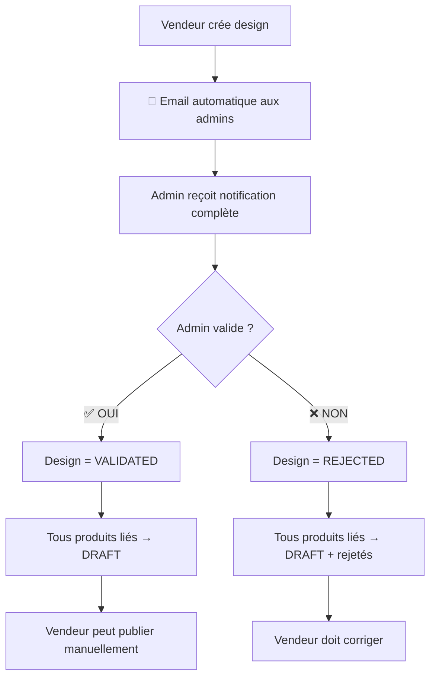

# Guide Frontend : Nouvelle Logique de Validation Design & Produits

## 📋 Vue d'ensemble - Décembre 2024

### 🔄 Nouveau Workflow Complet



---

## 🎯 1. Création de Design - Notification Automatique

### Endpoint : `POST /api/designs`

**NOUVEAU:** Email automatique envoyé aux admins dès la création !

```typescript
// Interface pour création design
interface CreateDesignRequest {
  name: string;
  description?: string;
  price: number;
  category: 'LOGO' | 'PATTERN' | 'ILLUSTRATION' | 'TYPOGRAPHY' | 'ABSTRACT';
  tags?: string;
  file: File; // Image du design
}

// Exemple d'appel
const createDesign = async (designData: CreateDesignRequest) => {
  const formData = new FormData();
  formData.append('name', designData.name);
  formData.append('price', designData.price.toString());
  formData.append('category', designData.category);
  formData.append('file', designData.file);
  
  if (designData.description) {
    formData.append('description', designData.description);
  }
  
  if (designData.tags) {
    formData.append('tags', designData.tags);
  }

  const response = await fetch('/api/designs', {
    method: 'POST',
    headers: {
      'Authorization': `Bearer ${token}` // ou cookies
    },
    body: formData
  });

  if (!response.ok) {
    throw new Error('Erreur création design');
  }

  return await response.json();
};
```

### ✅ Actions Frontend après création

```typescript
// Composant de création design
const CreateDesignForm = () => {
  const [loading, setLoading] = useState(false);
  
  const handleSubmit = async (designData: CreateDesignRequest) => {
    setLoading(true);
    
    try {
      const result = await createDesign(designData);
      
      // ✅ Nouveau message explicite
      showNotification({
        type: 'success',
        title: 'Design créé avec succès !',
        message: `Votre design "${result.name}" a été créé et les administrateurs ont été notifiés automatiquement. Vous recevrez un email dès qu'il sera validé.`,
        duration: 6000
      });
      
      // Rediriger vers la liste des designs
      router.push('/vendor/designs');
      
    } catch (error) {
      showNotification({
        type: 'error',
        title: 'Erreur',
        message: error.message
      });
    } finally {
      setLoading(false);
    }
  };
  
  return (
    <form onSubmit={handleSubmit}>
      {/* Formulaire avec indication de la nouvelle logique */}
      <div className="info-banner">
        📧 <strong>Nouveau :</strong> Les administrateurs seront automatiquement notifiés 
        par email dès la création de votre design !
      </div>
      
      {/* Champs du formulaire... */}
    </form>
  );
};
```

---

## 🛡️ 2. Validation Admin - Interface d'Administration

### Endpoints pour l'admin

```typescript
// 🆕 NOUVEAU: Récupérer TOUS les designs (dès création)
interface AllDesignsRequest {
  page?: number;
  limit?: number;
  search?: string;
  status?: 'PENDING' | 'VALIDATED' | 'REJECTED' | 'ALL';
  sortBy?: 'createdAt' | 'price' | 'vendor';
  sortOrder?: 'asc' | 'desc';
}

const getAllDesigns = async (params: AllDesignsRequest = {}) => {
  const queryParams = new URLSearchParams({
    page: (params.page || 1).toString(),
    limit: (params.limit || 20).toString(),
    status: params.status || 'ALL',
    sortBy: params.sortBy || 'createdAt',
    sortOrder: params.sortOrder || 'desc'
  });
  
  if (params.search) {
    queryParams.append('search', params.search);
  }

  const response = await fetch(`/api/designs/admin/all?${queryParams}`, {
    headers: {
      'Authorization': `Bearer ${adminToken}`
    }
  });

  return await response.json();
};

// Récupérer designs en attente (ancien endpoint - optionnel)
interface PendingDesignsRequest {
  page?: number;
  limit?: number;
  search?: string;
  sortBy?: 'submittedForValidationAt' | 'price' | 'vendorName';
  sortOrder?: 'asc' | 'desc';
}

const getPendingDesigns = async (params: PendingDesignsRequest = {}) => {
  const queryParams = new URLSearchParams({
    page: (params.page || 1).toString(),
    limit: (params.limit || 20).toString(),
    sortBy: params.sortBy || 'submittedForValidationAt',
    sortOrder: params.sortOrder || 'desc'
  });
  
  if (params.search) {
    queryParams.append('search', params.search);
  }

  const response = await fetch(`/api/designs/admin/pending?${queryParams}`, {
    headers: {
      'Authorization': `Bearer ${adminToken}`
    }
  });

  return await response.json();
};

// Valider ou rejeter un design
const validateDesign = async (
  designId: number, 
  action: 'VALIDATE' | 'REJECT', 
  rejectionReason?: string
) => {
  const response = await fetch(`/api/designs/${designId}/validate`, {
    method: 'PUT',
    headers: {
      'Content-Type': 'application/json',
      'Authorization': `Bearer ${adminToken}`
    },
    body: JSON.stringify({
      action,
      rejectionReason: action === 'REJECT' ? rejectionReason : undefined
    })
  });

  if (!response.ok) {
    throw new Error('Erreur validation design');
  }

  return await response.json();
};
```

### Interface Admin - Composant React

```typescript
const AdminDesignValidation = () => {
  const [designs, setDesigns] = useState([]);
  const [loading, setLoading] = useState(false);
  const [statusFilter, setStatusFilter] = useState<'ALL' | 'PENDING' | 'VALIDATED' | 'REJECTED'>('PENDING');
  const [stats, setStats] = useState({
    total: 0,
    pending: 0,
    validated: 0,
    rejected: 0
  });
  
  useEffect(() => {
    loadDesigns();
  }, [statusFilter]);
  
  const loadDesigns = async () => {
    setLoading(true);
    try {
      // 🆕 Utiliser le nouveau endpoint qui récupère TOUS les designs
      const result = await getAllDesigns({ 
        status: statusFilter,
        sortBy: 'createdAt',
        sortOrder: 'desc'
      });
      
      setDesigns(result.data.designs);
      setStats({
        total: result.data.stats.total,
        pending: result.data.stats.pending,
        validated: result.data.stats.published, // published = validated
        rejected: result.data.stats.draft // draft = rejected dans ce contexte
      });
    } catch (error) {
      console.error('Erreur chargement designs:', error);
    } finally {
      setLoading(false);
    }
  };
  
  const handleValidation = async (designId: number, action: 'VALIDATE' | 'REJECT', reason?: string) => {
    try {
      await validateDesign(designId, action, reason);
      
      showNotification({
        type: 'success',
        title: `Design ${action === 'VALIDATE' ? 'validé' : 'rejeté'}`,
        message: action === 'VALIDATE' 
          ? 'Le design a été validé. Tous les produits liés sont maintenant en brouillon et le vendeur peut les publier.'
          : 'Le design a été rejeté. Le vendeur a été notifié par email.'
      });
      
      // Recharger la liste
      loadDesigns();
      
    } catch (error) {
      showNotification({
        type: 'error',
        title: 'Erreur',
        message: error.message
      });
    }
  };
  
  return (
    <div className="admin-design-validation">
      <div className="admin-header">
        <h2>Validation des Designs</h2>
        
        {/* 🆕 Statistiques en temps réel */}
        <div className="stats-bar">
          <div className="stat-item">
            <span className="stat-number">{stats.total}</span>
            <span className="stat-label">Total</span>
          </div>
          <div className="stat-item pending">
            <span className="stat-number">{stats.pending}</span>
            <span className="stat-label">En attente</span>
          </div>
          <div className="stat-item validated">
            <span className="stat-number">{stats.validated}</span>
            <span className="stat-label">Validés</span>
          </div>
          <div className="stat-item rejected">
            <span className="stat-number">{stats.rejected}</span>
            <span className="stat-label">Rejetés</span>
          </div>
        </div>
        
        {/* 🆕 Filtres par statut */}
        <div className="status-filters">
          {['ALL', 'PENDING', 'VALIDATED', 'REJECTED'].map(status => (
            <button
              key={status}
              onClick={() => setStatusFilter(status as any)}
              className={`filter-btn ${statusFilter === status ? 'active' : ''}`}
            >
              {status === 'ALL' ? 'Tous' :
               status === 'PENDING' ? 'En attente' :
               status === 'VALIDATED' ? 'Validés' : 'Rejetés'}
            </button>
          ))}
        </div>
      </div>
      
      {/* 🆕 Message d'information pour nouveaux designs */}
      {statusFilter === 'PENDING' && (
        <div className="info-banner">
          📧 <strong>Nouveau :</strong> Les designs apparaissent automatiquement ici dès leur création. 
          Plus besoin d'attendre que le vendeur les soumette !
        </div>
      )}
      
      <div className="designs-grid">
        {designs.map(design => (
          <div key={design.id} className="design-card">
            <div className="design-image">
              
              <div className={`status-badge ${design.validationStatus.toLowerCase()}`}>
                {design.validationStatus === 'PENDING' ? '⏳ En attente' :
                 design.validationStatus === 'VALIDATED' ? '✅ Validé' :
                 '❌ Rejeté'}
              </div>
            </div>
            
            <div className="design-info">
              <h3>{design.name}</h3>
              <p className="vendor-info">
                Vendeur: {design.vendor?.firstName} {design.vendor?.lastName}
              </p>
              <p className="price">Prix: {design.price.toLocaleString()} FCFA</p>
              <p className="category">Catégorie: {design.category}</p>
              <p className="created-date">
                Créé le: {new Date(design.createdAt).toLocaleDateString('fr-FR')}
              </p>
              
              {/* Afficher raison de rejet si applicable */}
              {design.validationStatus === 'REJECTED' && design.rejectionReason && (
                <div className="rejection-reason">
                  <strong>Raison du rejet:</strong>
                  <p>{design.rejectionReason}</p>
                </div>
              )}
            </div>
            
            {/* Actions de validation (seulement pour designs en attente) */}
            {design.validationStatus === 'PENDING' && (
              <div className="validation-actions">
                <button 
                  onClick={() => handleValidation(design.id, 'VALIDATE')}
                  className="btn-validate"
                >
                  ✅ Valider
                </button>
                
                <button 
                  onClick={() => {
                    const reason = prompt('Raison du rejet:');
                    if (reason) {
                      handleValidation(design.id, 'REJECT', reason);
                    }
                  }}
                  className="btn-reject"
                >
                  ❌ Rejeter
                </button>
              </div>
            )}
            
            {/* Informations sur le validateur si traité */}
            {design.validationStatus !== 'PENDING' && design.validatorName && (
              <div className="validator-info">
                <small>
                  Traité par: {design.validatorName}
                  {design.validatedAt && ` le ${new Date(design.validatedAt).toLocaleDateString('fr-FR')}`}
                </small>
              </div>
            )}
          </div>
        ))}
      </div>
      
      {designs.length === 0 && !loading && (
        <div className="empty-state">
          <p>Aucun design trouvé pour le filtre sélectionné.</p>
        </div>
      )}
    </div>
  );
};
```

---

## 📦 3. Gestion des Produits - Côté Vendeur

### Interface des statuts de produit

```typescript
interface VendorProduct {
  id: number;
  vendorName: string;
  price: number;
  status: 'DRAFT' | 'PUBLISHED' | 'PENDING';
  isValidated: boolean;
  designId?: number;
  design?: {
    id: number;
    name: string;
    validationStatus: 'PENDING' | 'VALIDATED' | 'REJECTED';
  };
  createdAt: string;
  updatedAt: string;
}
```

### Publication manuelle par le vendeur

**NOUVEAU ENDPOINT:** `PUT /api/vendor-publish/products/:id/publish`

```typescript
const publishProduct = async (productId: number) => {
  const response = await fetch(`/api/vendor-publish/products/${productId}/publish`, {
    method: 'PUT',
    headers: {
      'Authorization': `Bearer ${vendorToken}`
    }
  });

  if (!response.ok) {
    const error = await response.json();
    throw new Error(error.message || 'Erreur publication produit');
  }

  return await response.json();
};
```

### Composant Liste Produits Vendeur

```typescript
const VendorProductsList = () => {
  const [products, setProducts] = useState<VendorProduct[]>([]);
  
  const handlePublish = async (productId: number) => {
    try {
      const result = await publishProduct(productId);
      
      showNotification({
        type: 'success',
        title: 'Produit publié !',
        message: result.message
      });
      
      // Recharger la liste
      loadProducts();
      
    } catch (error) {
      showNotification({
        type: 'error',
        title: 'Erreur publication',
        message: error.message
      });
    }
  };
  
  const getStatusBadge = (product: VendorProduct) => {
    if (product.status === 'PUBLISHED') {
      return <span className="badge-published">✅ Publié</span>;
    }
    
    if (product.status === 'DRAFT') {
      if (product.design?.validationStatus === 'VALIDATED') {
        return (
          <div className="badge-ready">
            <span className="badge-draft">📝 Brouillon</span>
            <button 
              onClick={() => handlePublish(product.id)}
              className="btn-publish-now"
            >
              🚀 Publier maintenant
            </button>
          </div>
        );
      } else if (product.design?.validationStatus === 'REJECTED') {
        return <span className="badge-rejected">❌ Design rejeté</span>;
      } else {
        return <span className="badge-pending">⏳ Design en attente</span>;
      }
    }
    
    return <span className="badge-pending">⏳ En attente</span>;
  };
  
  return (
    <div className="vendor-products">
      <h2>Mes Produits</h2>
      
      {/* Légende des nouveaux statuts */}
      <div className="status-legend">
        <h4>📚 Nouveau système de publication :</h4>
        <ul>
          <li><span className="badge-pending">⏳</span> Design en attente de validation admin</li>
          <li><span className="badge-draft">📝</span> Design validé → Vous pouvez publier quand vous voulez</li>
          <li><span className="badge-published">✅</span> Produit publié et visible aux clients</li>
          <li><span className="badge-rejected">❌</span> Design rejeté → Veuillez corriger</li>
        </ul>
      </div>
      
      <div className="products-grid">
        {products.map(product => (
          <div key={product.id} className="product-card">
            <h3>{product.vendorName}</h3>
            <p>Prix: {product.price.toLocaleString()} FCFA</p>
            
            {/* Nouveau système de badges */}
            {getStatusBadge(product)}
            
            {/* Informations sur le design */}
            {product.design && (
              <div className="design-info">
                <small>Design: {product.design.name}</small>
                <small>Statut design: {product.design.validationStatus}</small>
              </div>
            )}
          </div>
        ))}
      </div>
    </div>
  );
};
```

---

## 🎨 4. CSS pour les nouveaux statuts

```css
/* Badges de statut */
.badge-published {
  background: #10b981;
  color: white;
  padding: 4px 8px;
  border-radius: 4px;
  font-size: 12px;
}

.badge-draft {
  background: #f59e0b;
  color: white;
  padding: 4px 8px;
  border-radius: 4px;
  font-size: 12px;
}

.badge-pending {
  background: #6b7280;
  color: white;
  padding: 4px 8px;
  border-radius: 4px;
  font-size: 12px;
}

.badge-rejected {
  background: #ef4444;
  color: white;
  padding: 4px 8px;
  border-radius: 4px;
  font-size: 12px;
}

.badge-ready {
  display: flex;
  gap: 8px;
  align-items: center;
}

.btn-publish-now {
  background: #059669;
  color: white;
  border: none;
  padding: 4px 8px;
  border-radius: 4px;
  font-size: 11px;
  cursor: pointer;
  transition: background 0.2s;
}

.btn-publish-now:hover {
  background: #047857;
}

/* Légende des statuts */
.status-legend {
  background: #f9fafb;
  border: 1px solid #e5e7eb;
  border-radius: 8px;
  padding: 16px;
  margin-bottom: 24px;
}

.status-legend ul {
  list-style: none;
  padding: 0;
  margin: 8px 0 0 0;
}

.status-legend li {
  display: flex;
  align-items: center;
  gap: 8px;
  margin-bottom: 4px;
}

/* Cartes de produit */
.product-card {
  border: 1px solid #e5e7eb;
  border-radius: 8px;
  padding: 16px;
  background: white;
}

.design-info {
  margin-top: 8px;
  padding-top: 8px;
  border-top: 1px solid #e5e7eb;
}

.design-info small {
  display: block;
  color: #6b7280;
  font-size: 11px;
}

/* Notifications */
.info-banner {
  background: #dbeafe;
  border: 1px solid #93c5fd;
  border-radius: 6px;
  padding: 12px;
  margin-bottom: 16px;
  color: #1e40af;
}

/* 🆕 NOUVEAUX STYLES POUR L'INTERFACE ADMIN */

/* En-tête admin */
.admin-header {
  margin-bottom: 24px;
}

.admin-header h2 {
  margin: 0 0 16px 0;
  color: #1f2937;
  font-size: 24px;
  font-weight: 600;
}

/* Barre de statistiques */
.stats-bar {
  display: flex;
  gap: 16px;
  margin-bottom: 16px;
  padding: 16px;
  background: #f9fafb;
  border-radius: 8px;
  border: 1px solid #e5e7eb;
}

.stat-item {
  display: flex;
  flex-direction: column;
  align-items: center;
  padding: 12px 16px;
  background: white;
  border-radius: 6px;
  border: 1px solid #e5e7eb;
  min-width: 80px;
}

.stat-number {
  font-size: 24px;
  font-weight: 700;
  color: #1f2937;
}

.stat-label {
  font-size: 12px;
  color: #6b7280;
  text-transform: uppercase;
  letter-spacing: 0.5px;
}

.stat-item.pending .stat-number {
  color: #f59e0b;
}

.stat-item.validated .stat-number {
  color: #10b981;
}

.stat-item.rejected .stat-number {
  color: #ef4444;
}

/* Filtres de statut */
.status-filters {
  display: flex;
  gap: 8px;
  margin-bottom: 16px;
}

.filter-btn {
  padding: 8px 16px;
  border: 1px solid #d1d5db;
  background: white;
  color: #6b7280;
  border-radius: 6px;
  cursor: pointer;
  font-size: 14px;
  transition: all 0.2s;
}

.filter-btn:hover {
  background: #f3f4f6;
  border-color: #9ca3af;
}

.filter-btn.active {
  background: #3b82f6;
  color: white;
  border-color: #3b82f6;
}

/* Grille de designs */
.designs-grid {
  display: grid;
  grid-template-columns: repeat(auto-fill, minmax(320px, 1fr));
  gap: 20px;
}

/* Cartes de design améliorées */
.design-card {
  border: 1px solid #e5e7eb;
  border-radius: 12px;
  background: white;
  overflow: hidden;
  transition: box-shadow 0.2s, transform 0.2s;
}

.design-card:hover {
  box-shadow: 0 4px 12px rgba(0, 0, 0, 0.1);
  transform: translateY(-2px);
}

.design-image {
  position: relative;
  aspect-ratio: 16/9;
  overflow: hidden;
}

.design-image img {
  width: 100%;
  height: 100%;
  object-fit: cover;
}

.status-badge {
  position: absolute;
  top: 8px;
  right: 8px;
  padding: 4px 8px;
  border-radius: 4px;
  font-size: 11px;
  font-weight: 600;
  text-transform: uppercase;
}

.status-badge.pending {
  background: rgba(107, 114, 128, 0.9);
  color: white;
}

.status-badge.validated {
  background: rgba(16, 185, 129, 0.9);
  color: white;
}

.status-badge.rejected {
  background: rgba(239, 68, 68, 0.9);
  color: white;
}

.design-info {
  padding: 16px;
  border-top: none;
}

.design-info h3 {
  margin: 0 0 8px 0;
  font-size: 16px;
  font-weight: 600;
  color: #1f2937;
}

.vendor-info, .price, .category, .created-date {
  margin: 4px 0;
  font-size: 14px;
  color: #6b7280;
}

.price {
  font-weight: 600;
  color: #059669;
}

.rejection-reason {
  margin-top: 12px;
  padding: 12px;
  background: #fef2f2;
  border: 1px solid #fecaca;
  border-radius: 6px;
}

.rejection-reason strong {
  color: #dc2626;
  font-size: 12px;
  text-transform: uppercase;
  letter-spacing: 0.5px;
}

.rejection-reason p {
  margin: 4px 0 0 0;
  font-size: 13px;
  color: #7f1d1d;
}

/* Actions de validation */
.validation-actions {
  display: flex;
  gap: 8px;
  padding: 16px;
  border-top: 1px solid #e5e7eb;
  background: #f9fafb;
}

.btn-validate, .btn-reject {
  flex: 1;
  padding: 8px 16px;
  border: none;
  border-radius: 6px;
  font-size: 14px;
  font-weight: 500;
  cursor: pointer;
  transition: all 0.2s;
}

.btn-validate {
  background: #10b981;
  color: white;
}

.btn-validate:hover {
  background: #059669;
}

.btn-reject {
  background: #ef4444;
  color: white;
}

.btn-reject:hover {
  background: #dc2626;
}

/* Informations du validateur */
.validator-info {
  padding: 12px 16px;
  background: #f3f4f6;
  border-top: 1px solid #e5e7eb;
}

.validator-info small {
  color: #6b7280;
  font-size: 12px;
}

/* État vide */
.empty-state {
  text-align: center;
  padding: 48px 24px;
  color: #6b7280;
}

.empty-state p {
  font-size: 16px;
  margin: 0;
}

/* Responsive */
@media (max-width: 768px) {
  .stats-bar {
    flex-wrap: wrap;
    gap: 8px;
  }
  
  .stat-item {
    min-width: calc(50% - 4px);
  }
  
  .status-filters {
    flex-wrap: wrap;
  }
  
  .designs-grid {
    grid-template-columns: 1fr;
  }
  
  .validation-actions {
    flex-direction: column;
  }
}
```

---

## 📬 5. Gestion des Notifications et Emails

### Composant de notification toast

```typescript
interface Notification {
  id: string;
  type: 'success' | 'error' | 'info' | 'warning';
  title: string;
  message: string;
  duration?: number;
}

const NotificationManager = () => {
  const [notifications, setNotifications] = useState<Notification[]>([]);
  
  const showNotification = (notification: Omit<Notification, 'id'>) => {
    const id = Math.random().toString(36).substr(2, 9);
    const newNotification: Notification = {
      ...notification,
      id,
      duration: notification.duration || 5000
    };
    
    setNotifications(prev => [...prev, newNotification]);
    
    // Auto-remove
    setTimeout(() => {
      setNotifications(prev => prev.filter(n => n.id !== id));
    }, newNotification.duration);
  };
  
  return (
    <div className="notification-container">
      {notifications.map(notification => (
        <div key={notification.id} className={`notification notification-${notification.type}`}>
          <h4>{notification.title}</h4>
          <p>{notification.message}</p>
        </div>
      ))}
    </div>
  );
};
```

---

## 🔔 6. Intégration WebSocket (optionnel)

Pour les notifications en temps réel :

```typescript
const useRealtimeNotifications = (userId: number) => {
  useEffect(() => {
    const socket = new WebSocket(`ws://localhost:3000/notifications?userId=${userId}`);
    
    socket.onmessage = (event) => {
      const notification = JSON.parse(event.data);
      
      if (notification.type === 'DESIGN_VALIDATED') {
        showNotification({
          type: 'success',
          title: 'Design validé !',
          message: `Votre design "${notification.designName}" a été approuvé. Vos produits sont maintenant en brouillon et prêts à être publiés.`
        });
        
        // Recharger la liste des produits
        refreshProductsList();
      }
      
      if (notification.type === 'DESIGN_REJECTED') {
        showNotification({
          type: 'error',
          title: 'Design rejeté',
          message: `Votre design "${notification.designName}" a été rejeté. Raison: ${notification.rejectionReason}`
        });
      }
    };
    
    return () => socket.close();
  }, [userId]);
};
```

---

## 📊 7. Tableau de Bord - Statistiques

```typescript
const VendorDashboard = () => {
  const [stats, setStats] = useState({
    designs: {
      total: 0,
      pending: 0,
      validated: 0,
      rejected: 0
    },
    products: {
      total: 0,
      draft: 0,
      published: 0,
      readyToPublish: 0 // Nouveaux produits prêts à publier
    }
  });
  
  return (
    <div className="dashboard">
      <h1>Tableau de Bord Vendeur</h1>
      
      {/* Alerte pour produits prêts à publier */}
      {stats.products.readyToPublish > 0 && (
        <div className="alert alert-info">
          🚀 <strong>{stats.products.readyToPublish} produit(s)</strong> prêt(s) à être publié(s) !
          <Link href="/vendor/products?filter=ready">Voir les produits →</Link>
        </div>
      )}
      
      <div className="stats-grid">
        {/* Cartes de statistiques... */}
      </div>
    </div>
  );
};
```

---

## ⚡ 8. Actions Rapides - Résumé Frontend

### Pour les Vendeurs :

1. **Créer un design** → Message automatique : "Admins notifiés"
2. **Attendre validation** → Badge "⏳ En attente"
3. **Design validé** → Badge "📝 Brouillon" + Bouton "🚀 Publier"
4. **Publier manuellement** → Produit visible aux clients

### Pour les Admins :

1. **🆕 Recevoir email automatique** à la création de design
2. **🆕 Aller sur interface admin** → `/admin/designs/all` (voir TOUS les designs)
3. **🆕 Filtrer par statut** → PENDING, VALIDATED, REJECTED, ALL
4. **Valider/Rejeter directement** → Vendeur notifié automatiquement
5. **Si validé** → Produits passent en DRAFT (vendeur publie quand il veut)

### 🔗 Endpoints Admin Principaux :

- **`GET /api/designs/admin/all`** → 🆕 Tous les designs (recommandé)
- **`GET /api/designs/admin/pending`** → Seulement les designs en attente (ancien)
- **`PUT /api/designs/:id/validate`** → Valider/rejeter un design

### 🎯 Workflow Admin Simplifié :

```mermaid
graph LR
    A[📧 Email reçu] --> B[Ouvrir /admin/designs/all]
    B --> C[Filtrer: PENDING]
    C --> D[Voir design + infos vendeur]
    D --> E{Valider ?}
    E -->|✅| F[Clic "Valider"]
    E -->|❌| G[Clic "Rejeter" + raison]
    F --> H[Produits → DRAFT]
    G --> I[Vendeur notifié]
    H --> J[Vendeur peut publier]
```

---

## 🎯 9. Points d'Attention

### ✅ Ce qui a changé :
- ✅ Email automatique aux admins dès création design
- ✅ Validation design → produits en DRAFT (pas PUBLISHED)
- ✅ Vendeur publie manuellement quand il veut
- ✅ Nouveau workflow plus flexible

### ⚠️ Migrations nécessaires :
- Interface admin pour validation designs
- Boutons "Publier" pour vendeurs
- Nouveaux badges de statut
- Messages explicatifs

### 🔧 Tests recommandés :
1. Créer design → Vérifier email admin
2. Valider design → Vérifier produits en DRAFT
3. Publication manuelle → Vérifier passage en PUBLISHED
4. Rejection design → Vérifier email vendeur

Le vendeur garde maintenant la main sur le timing de publication ! 🎉 