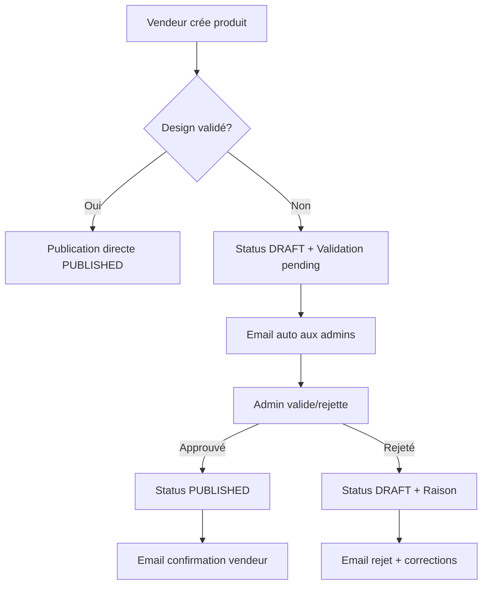

# Guide Frontend – Validation Automatique des Designs

> **NOUVEAU COMPORTEMENT** : Lorsqu'un vendeur publie un produit avec un design non validé par l'admin, le produit est automatiquement mis en statut `DRAFT` et soumis pour validation. Le vendeur ne peut plus publier directement un produit avec un design non approuvé.

---

## 1. Nouveau Comportement Backend

### 1.1 Logique de Validation Automatique

| Scénario | Résultat | Statut Produit | Action |
|----------|----------|----------------|--------|
| Design existant + validé (`isValidated = true`) | ✅ Publication directe | `PUBLISHED` | Produit immédiatement disponible |
| Design existant + non validé (`isValidated = false`) | ⏳ En attente | `DRAFT` | Soumission automatique pour validation admin |
| Nouveau design (upload) | ⏳ En attente | `DRAFT` | Soumission automatique pour validation admin |

### 1.2 Réponse API Étendue

```typescript
interface VendorPublishResponse {
  success: boolean;
  productId: number;
  message: string;
  status: 'PUBLISHED' | 'DRAFT';        // ← NOUVEAU
  needsValidation: boolean;              // ← NOUVEAU  
  imagesProcessed: number;
  imageDetails: {
    totalImages: number;
    colorImages: number;
    defaultImage: number;
    uploadedToCloudinary: number;
  };
}
```

---

## 2. Impact sur l'Expérience Utilisateur

### 2.1 Messages à Afficher

```typescript
// Après appel de l'API de publication
const handlePublishResponse = (response: VendorPublishResponse) => {
  if (response.needsValidation) {
    // Toast d'information
    toast.info(response.message); 
    // Ex: "Le design 'Logo Flamme' n'est pas encore validé par l'admin. Votre produit sera en attente de validation."
    
    // Rediriger vers la liste des produits en attente
    navigate('/vendor/products?status=pending');
  } else {
    // Publication réussie
    toast.success(response.message);
    // Ex: "Produit publié avec succès"
    
    navigate('/vendor/products?status=published');
  }
};
```

### 2.2 États des Produits dans l'Interface

```typescript
function getProductStatusBadge(product: VendorProduct) {
  if (product.status === 'PUBLISHED' && product.isValidated) {
    return <Badge color="green">✅ Publié</Badge>;
  }
  
  if (product.status === 'DRAFT' && product.submittedForValidationAt) {
    return <Badge color="yellow">⏳ En attente admin</Badge>;
  }
  
  if (product.status === 'DRAFT' && product.rejectionReason) {
    return <Badge color="red">❌ Rejeté</Badge>;
  }
  
  return <Badge color="gray">📝 Brouillon</Badge>;
}
```

---

## 3. Service Frontend Mis à Jour

### 3.1 Service de Publication avec Validation

```typescript
export class VendorProductService {
  
  // Publication avec gestion automatique de la validation
  async publishProduct(productData: VendorPublishData): Promise<VendorPublishResponse> {
    const response = await fetch('/api/vendor/publish', {
      method: 'POST',
      headers: { 'Content-Type': 'application/json' },
      credentials: 'include',
      body: JSON.stringify(productData)
    });

    if (!response.ok) {
      throw new Error(`Erreur ${response.status}: ${await response.text()}`);
    }

    return response.json();
  }

  // Récupérer les produits avec filtrage par statut de validation
  async getProducts(filters?: {
    status?: 'published' | 'pending' | 'rejected' | 'draft';
    limit?: number;
    offset?: number;
  }) {
    const params = new URLSearchParams();
    if (filters?.status) params.append('status', filters.status);
    if (filters?.limit) params.append('limit', filters.limit.toString());
    if (filters?.offset) params.append('offset', filters.offset.toString());

    const response = await fetch(`/api/vendor/products?${params}`, {
      credentials: 'include'
    });

    return response.json();
  }

  // Vérifier le statut d'un design avant utilisation
  async checkDesignValidation(designId: number): Promise<{isValidated: boolean, canPublish: boolean}> {
    const response = await fetch(`/api/designs/${designId}/status`, {
      credentials: 'include'
    });
    
    const design = await response.json();
    return {
      isValidated: design.isValidated,
      canPublish: design.isValidated // Peut publier seulement si validé
    };
  }
}
```

### 3.2 Hook React pour Gestion des États

```typescript
export const useVendorProductValidation = () => {
  const [isPublishing, setIsPublishing] = useState(false);
  const [validationStatus, setValidationStatus] = useState<'idle' | 'validating' | 'pending' | 'approved' | 'rejected'>('idle');

  const publishWithValidation = async (productData: VendorPublishData) => {
    setIsPublishing(true);
    setValidationStatus('validating');

    try {
      const result = await vendorProductService.publishProduct(productData);
      
      if (result.needsValidation) {
        setValidationStatus('pending');
        return {
          ...result,
          userMessage: 'Produit créé et soumis pour validation admin'
        };
      } else {
        setValidationStatus('approved');
        return {
          ...result,
          userMessage: 'Produit publié avec succès'
        };
      }
    } catch (error) {
      setValidationStatus('rejected');
      throw error;
    } finally {
      setIsPublishing(false);
    }
  };

  return {
    publishWithValidation,
    isPublishing,
    validationStatus
  };
};
```

---

## 4. Composants UI Recommandés

### 4.1 Indicateur de Statut avec Tooltip

```tsx
export const ProductValidationStatus = ({ product }: { product: VendorProduct }) => {
  const getStatusInfo = () => {
    if (product.status === 'PUBLISHED' && product.isValidated) {
      return { color: 'green', icon: '✅', text: 'Publié', tooltip: 'Produit en ligne et visible par les clients' };
    }
    
    if (product.submittedForValidationAt && !product.isValidated) {
      return { 
        color: 'yellow', 
        icon: '⏳', 
        text: 'En attente', 
        tooltip: `Soumis le ${formatDate(product.submittedForValidationAt)}. En attente de validation admin.`
      };
    }
    
    if (product.rejectionReason) {
      return { 
        color: 'red', 
        icon: '❌', 
        text: 'Rejeté', 
        tooltip: `Motif: ${product.rejectionReason}`
      };
    }
    
    return { color: 'gray', icon: '📝', text: 'Brouillon', tooltip: 'Produit non publié' };
  };

  const status = getStatusInfo();

  return (
    <Tooltip content={status.tooltip}>
      <Badge color={status.color}>
        {status.icon} {status.text}
      </Badge>
    </Tooltip>
  );
};
```

### 4.2 Dashboard des Validations en Attente

```tsx
export const VendorValidationDashboard = () => {
  const [pendingProducts, setPendingProducts] = useState([]);
  const [loading, setLoading] = useState(true);

  useEffect(() => {
    const fetchPendingProducts = async () => {
      try {
        const result = await vendorProductService.getProducts({ status: 'pending' });
        setPendingProducts(result.products);
      } catch (error) {
        toast.error('Erreur lors du chargement des produits en attente');
      } finally {
        setLoading(false);
      }
    };

    fetchPendingProducts();
  }, []);

  if (loading) return <Spinner />;

  return (
    <div className="validation-dashboard">
      <h2>Produits en Attente de Validation</h2>
      
      {pendingProducts.length === 0 ? (
        <EmptyState 
          title="Aucun produit en attente"
          description="Tous vos produits ont été traités par l'équipe admin"
        />
      ) : (
        <div className="products-grid">
          {pendingProducts.map(product => (
            <ProductCard 
              key={product.id} 
              product={product}
              showValidationStatus
              disabled // Pas d'édition possible pendant validation
            />
          ))}
        </div>
      )}
    </div>
  );
};
```

---

## 5. Workflow Frontend Complet

### 5.1 Étapes de Publication



### 5.2 Points d'Attention pour l'UI

1. **Feedback immédiat** : Toujours afficher le résultat de la publication
2. **Statuts clairs** : Utiliser des couleurs et icônes cohérentes
3. **Actions contextuelles** : Boutons adaptés selon le statut
4. **Notifications** : WebSocket pour mises à jour en temps réel
5. **Historique** : Traçabilité des validations/rejets

---

## 6. Points Clés pour les Développeurs

✅ **Nouveau comportement** : Plus de publication directe avec design non validé  
✅ **API enrichie** : Champs `status` et `needsValidation` dans la réponse  
✅ **UX améliorée** : Messages clairs selon le statut  
✅ **Validation automatique** : Pas d'action manuelle du vendeur requise  
✅ **Notifications** : Emails automatiques à tous les acteurs  

🎯 **Résultat** : Contrôle qualité renforcé tout en gardant une expérience fluide pour les vendeurs. 