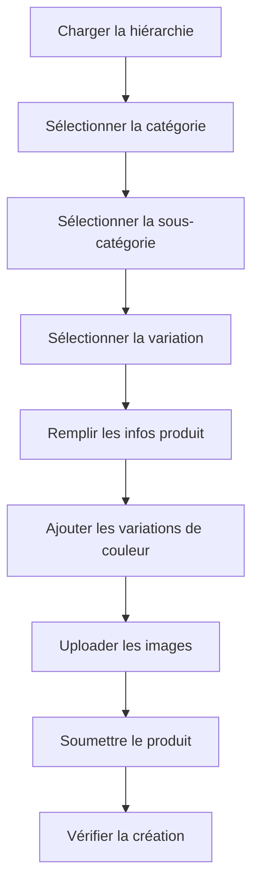

# 🛍️ Guide Frontend - Création de Produit avec Hiérarchie

> **Guide complet pour les développeurs frontend sur comment créer un produit et l'associer à une catégorie, sous-catégorie et variation**

## 📋 Table des matières

1. [Vue d'ensemble de l'architecture](#vue-densemble-de-larchitecture)
2. [Flux de création de produit](#flux-de-création-de-produit)
3. [Étape 1 - Récupérer la hiérarchie](#étape-1---récupérer-la-hiérarchie)
4. [Étape 2 - Créer le produit](#étape-2---créer-le-produit)
5. [Exemples de code](#exemples-de-code)
6. [Mockups et composants UI](#mockups-et-composants-ui)
7. [Gestion des erreurs](#gestion-des-erreurs)
8. [Bonnes pratiques](#bonnes-pratiques)

---

## 🏗️ Vue d'ensemble de l'architecture

Le système utilise une **hiérarchie à 3 niveaux** pour classer les produits :

```
📁 Catégorie (Level 0)
   └── 📂 Sous-catégorie (Level 1)
       └── 🎨 Variation (Level 2)
           └── 📦 Produit
```

### Exemple concret :
```
📁 Mode Femme
   └── 📂 Robes
       └── 🎨 Robe Longue
           └── 📦 Robe Longue Soie Noire
```

### Champs obligatoires par niveau :
- **Catégorie** : `name` (requis), `description`, `displayOrder`
- **Sous-catégorie** : `name`, `categoryId` (requis), `description`, `displayOrder`
- **Variation** : `name`, `subCategoryId` (requis), `description`, `displayOrder`
- **Produit** : `name`, `description`, `price`, `colorVariations` (requis)

---

## 🔄 Flux de création de produit

Le flux complet pour créer un produit avec sa hiérarchie :



### Vue d'ensemble des endpoints :
```
GET /categories/hierarchy     → Récupérer toute la hiérarchie
POST /products                → Créer un nouveau produit
GET /products/:id             → Vérifier le produit créé
```

---

## 📊 Étape 1 - Récupérer la hiérarchie

### Endpoint :
```http
GET /categories/hierarchy
```

### Réponse attendue :
```json
{
  "categories": [
    {
      "id": 1,
      "name": "Mode Femme",
      "slug": "mode-femme",
      "description": "Vêtements et accessoires pour femme",
      "subCategories": [
        {
          "id": 1,
          "name": "Robes",
          "slug": "robes",
          "description": "Robes élégantes pour toutes occasions",
          "categoryId": 1,
          "variations": [
            {
              "id": 1,
              "name": "Robe Longue",
              "slug": "robe-longue",
              "description": "Robe longue et élégante",
              "subCategoryId": 1
            },
            {
              "id": 2,
              "name": "Robe Cocktail",
              "slug": "robe-cocktail",
              "description": "Robe courte pour soirées",
              "subCategoryId": 1
            }
          ]
        }
      ]
    }
  ]
}
```

### Exemple de code - React Hook :
```typescript
// hooks/useProductHierarchy.ts
import { useState, useEffect } from 'react';

interface Variation {
  id: number;
  name: string;
  slug: string;
  description: string;
  subCategoryId: number;
}

interface SubCategory {
  id: number;
  name: string;
  slug: string;
  description: string;
  categoryId: number;
  variations: Variation[];
}

interface Category {
  id: number;
  name: string;
  slug: string;
  description: string;
  subCategories: SubCategory[];
}

interface HierarchyResponse {
  categories: Category[];
}

export const useProductHierarchy = () => {
  const [hierarchy, setHierarchy] = useState<Category[]>([]);
  const [loading, setLoading] = useState(true);
  const [error, setError] = useState<string | null>(null);

  useEffect(() => {
    const fetchHierarchy = async () => {
      try {
        setLoading(true);
        const response = await fetch('/categories/hierarchy');

        if (!response.ok) {
          throw new Error(`HTTP error! status: ${response.status}`);
        }

        const data: HierarchyResponse = await response.json();
        setHierarchy(data.categories);
      } catch (err) {
        setError(err instanceof Error ? err.message : 'Erreur inconnue');
      } finally {
        setLoading(false);
      }
    };

    fetchHierarchy();
  }, []);

  return { hierarchy, loading, error };
};
```

---

## 📝 Étape 2 - Créer le produit

### Endpoint principal :
```http
POST /products
Content-Type: multipart/form-data
Authorization: Bearer <JWT_TOKEN>
```

### Structure des données à envoyer :

#### `productData` (JSON stringifié) :
```json
{
  "name": "Robe Longue Soie Noire",
  "description": "Magnifique robe longue en soie noire, parfaite pour les événements formels. Coupe ample avec élégance et finition irréprochable.",
  "price": 189.99,
  "suggestedPrice": 229.99,
  "stock": 25,
  "status": "published",
  "categoryId": 1,
  "subCategoryId": 1,
  "variationId": 1,
  "genre": "FEMME",
  "sizes": ["S", "M", "L", "XL"],
  "categories": ["Mode", "Robes", "Soie"],
  "colorVariations": [
    {
      "name": "Noir",
      "colorCode": "#000000",
      "images": [
        {
          "fileId": "temp_file_id_123",
          "view": "Front",
          "delimitations": [
            {
              "x": 50,
              "y": 30,
              "width": 30,
              "height": 40,
              "name": "Logo Zone",
              "coordinateType": "PERCENTAGE"
            }
          ]
        },
        {
          "fileId": "temp_file_id_124",
          "view": "Back"
        }
      ]
    }
  ]
}
```

#### `files` : Images uploadées

---

## 💻 Exemples de code

### 1. Composant React complet pour la création :
```typescript
// components/ProductCreationForm.tsx
import React, { useState, useCallback } from 'react';
import { useProductHierarchy } from '../hooks/useProductHierarchy';

interface ProductFormData {
  name: string;
  description: string;
  price: number;
  stock: number;
  categoryId: number;
  subCategoryId: number;
  variationId: number;
  genre: 'HOMME' | 'FEMME' | 'BEBE' | 'UNISEXE';
  sizes: string[];
  colorVariations: ColorVariation[];
}

const ProductCreationForm: React.FC = () => {
  const { hierarchy, loading, error } = useProductHierarchy();
  const [formData, setFormData] = useState<ProductFormData>({
    name: '',
    description: '',
    price: 0,
    stock: 0,
    categoryId: 0,
    subCategoryId: 0,
    variationId: 0,
    genre: 'UNISEXE',
    sizes: [],
    colorVariations: []
  });

  const [images, setImages] = useState<File[]>([]);
  const [submitting, setSubmitting] = useState(false);

  // Filtrer les sous-catégories basées sur la catégorie sélectionnée
  const availableSubCategories = hierarchy
    .find(cat => cat.id === formData.categoryId)
    ?.subCategories || [];

  // Filtrer les variations basées sur la sous-catégorie sélectionnée
  const availableVariations = availableSubCategories
    .find(sub => sub.id === formData.subCategoryId)
    ?.variations || [];

  const handleCategoryChange = (categoryId: number) => {
    setFormData(prev => ({
      ...prev,
      categoryId,
      subCategoryId: 0, // Reset
      variationId: 0    // Reset
    }));
  };

  const handleSubCategoryChange = (subCategoryId: number) => {
    setFormData(prev => ({
      ...prev,
      subCategoryId,
      variationId: 0    // Reset
    }));
  };

  const handleImageUpload = (e: React.ChangeEvent<HTMLInputElement>) => {
    const files = Array.from(e.target.files || []);
    setImages(prev => [...prev, ...files]);
  };

  const handleSubmit = async (e: React.FormEvent) => {
    e.preventDefault();
    setSubmitting(true);

    try {
      // Créer le FormData pour l'upload
      const formDataToSend = new FormData();

      // Ajouter les données du produit en JSON stringifié
      const productData = {
        ...formData,
        colorVariations: [{
          name: "Default",
          colorCode: "#000000",
          images: images.map((img, index) => ({
            fileId: `temp_${index}`,
            view: "Front"
          }))
        }]
      };

      formDataToSend.append('productData', JSON.stringify(productData));

      // Ajouter les fichiers images
      images.forEach((image) => {
        formDataToSend.append('files', image);
      });

      const response = await fetch('/products', {
        method: 'POST',
        headers: {
          'Authorization': `Bearer ${localStorage.getItem('token')}`
        },
        body: formDataToSend
      });

      if (!response.ok) {
        throw new Error(`Erreur: ${response.status}`);
      }

      const result = await response.json();
      console.log('Produit créé:', result);

    } catch (error) {
      console.error('Erreur lors de la création:', error);
    } finally {
      setSubmitting(false);
    }
  };

  if (loading) return <div>Chargement de la hiérarchie...</div>;
  if (error) return <div>Erreur: {error}</div>;

  return (
    <form onSubmit={handleSubmit} className="product-creation-form">
      {/* Informations de base */}
      <div className="form-section">
        <h3>Informations du produit</h3>
        <input
          type="text"
          placeholder="Nom du produit"
          value={formData.name}
          onChange={(e) => setFormData(prev => ({ ...prev, name: e.target.value }))}
          required
        />
        <textarea
          placeholder="Description"
          value={formData.description}
          onChange={(e) => setFormData(prev => ({ ...prev, description: e.target.value }))}
          required
        />
        <input
          type="number"
          placeholder="Prix"
          value={formData.price}
          onChange={(e) => setFormData(prev => ({ ...prev, price: parseFloat(e.target.value) }))}
          step="0.01"
          min="0"
          required
        />
      </div>

      {/* Hiérarchie des catégories */}
      <div className="form-section">
        <h3>Classification</h3>

        {/* Catégorie */}
        <select
          value={formData.categoryId}
          onChange={(e) => handleCategoryChange(Number(e.target.value))}
          required
        >
          <option value={0}>Sélectionner une catégorie</option>
          {hierarchy.map(category => (
            <option key={category.id} value={category.id}>
              {category.name}
            </option>
          ))}
        </select>

        {/* Sous-catégorie */}
        <select
          value={formData.subCategoryId}
          onChange={(e) => handleSubCategoryChange(Number(e.target.value))}
          required
          disabled={!formData.categoryId}
        >
          <option value={0}>Sélectionner une sous-catégorie</option>
          {availableSubCategories.map(sub => (
            <option key={sub.id} value={sub.id}>
              {sub.name}
            </option>
          ))}
        </select>

        {/* Variation */}
        <select
          value={formData.variationId}
          onChange={(e) => setFormData(prev => ({ ...prev, variationId: Number(e.target.value) }))}
          required
          disabled={!formData.subCategoryId}
        >
          <option value={0}>Sélectionner une variation</option>
          {availableVariations.map(variation => (
            <option key={variation.id} value={variation.id}>
              {variation.name}
            </option>
          ))}
        </select>

        {/* Genre */}
        <select
          value={formData.genre}
          onChange={(e) => setFormData(prev => ({ ...prev, genre: e.target.value as any }))}
        >
          <option value="UNISEXE">Unisex</option>
          <option value="HOMME">Homme</option>
          <option value="FEMME">Femme</option>
          <option value="BEBE">Bébé</option>
        </select>
      </div>

      {/* Images */}
      <div className="form-section">
        <h3>Images du produit</h3>
        <input
          type="file"
          multiple
          accept="image/*"
          onChange={handleImageUpload}
          required
        />
        <div className="image-preview">
          {images.map((image, index) => (
            <div key={index} className="image-preview-item">
              
              <span>{image.name}</span>
            </div>
          ))}
        </div>
      </div>

      <button type="submit" disabled={submitting}>
        {submitting ? 'Création en cours...' : 'Créer le produit'}
      </button>
    </form>
  );
};

export default ProductCreationForm;
```

### 2. Service API :
```typescript
// services/productService.ts
export interface CreateProductRequest {
  name: string;
  description: string;
  price: number;
  stock?: number;
  categoryId: number;
  subCategoryId: number;
  variationId: number;
  genre: 'HOMME' | 'FEMME' | 'BEBE' | 'UNISEXE';
  sizes?: string[];
  colorVariations: ColorVariation[];
  status?: 'published' | 'draft';
}

export interface ColorVariation {
  name: string;
  colorCode: string;
  images: ProductImage[];
}

export interface ProductImage {
  fileId: string;
  view: 'Front' | 'Back' | 'Left' | 'Right' | 'Top' | 'Bottom' | 'Detail';
  delimitations?: Delimitation[];
}

export interface Delimitation {
  x: number;
  y: number;
  width: number;
  height: number;
  name?: string;
  coordinateType?: 'PERCENTAGE' | 'ABSOLUTE';
}

class ProductService {
  private baseUrl = '/products';

  async createProduct(
    productData: CreateProductRequest,
    imageFiles: File[],
    token: string
  ): Promise<any> {
    const formData = new FormData();

    // Ajouter les données du produit
    formData.append('productData', JSON.stringify(productData));

    // Ajouter les images
    imageFiles.forEach(file => {
      formData.append('files', file);
    });

    const response = await fetch(this.baseUrl, {
      method: 'POST',
      headers: {
        'Authorization': `Bearer ${token}`,
      },
      body: formData
    });

    if (!response.ok) {
      const errorData = await response.json();
      throw new Error(errorData.message || `Erreur HTTP: ${response.status}`);
    }

    return response.json();
  }

  async getHierarchy(): Promise<Category[]> {
    const response = await fetch('/categories/hierarchy');

    if (!response.ok) {
      throw new Error(`Erreur lors de la récupération de la hiérarchie: ${response.status}`);
    }

    const data = await response.json();
    return data.categories;
  }

  async getProduct(id: number): Promise<Product> {
    const response = await fetch(`${this.baseUrl}/${id}`);

    if (!response.ok) {
      throw new Error(`Erreur lors de la récupération du produit: ${response.status}`);
    }

    return response.json();
  }
}

export const productService = new ProductService();
```

---

## 🎨 Mockups et composants UI

### 1. Structure des données mock :
```typescript
// mock/productMock.ts
export const mockHierarchy = {
  categories: [
    {
      id: 1,
      name: "Mode Femme",
      slug: "mode-femme",
      description: "Vêtements et accessoires pour femme",
      subCategories: [
        {
          id: 1,
          name: "Robes",
          slug: "robes",
          description: "Robes élégantes pour toutes occasions",
          categoryId: 1,
          variations: [
            {
              id: 1,
              name: "Robe Longue",
              slug: "robe-longue",
              description: "Robe longue et élégante",
              subCategoryId: 1
            },
            {
              id: 2,
              name: "Robe Cocktail",
              slug: "robe-cocktail",
              description: "Robe courte pour soirées",
              subCategoryId: 1
            }
          ]
        },
        {
          id: 2,
          name: "Tops",
          slug: "tops",
          description: "T-shirts, débardeurs et blouses",
          categoryId: 1,
          variations: [
            {
              id: 3,
              name: "T-shirt Manche Longue",
              slug: "t-shirt-manche-longue",
              description: "T-shirt confortable manche longue",
              subCategoryId: 2
            }
          ]
        }
      ]
    },
    {
      id: 2,
      name: "Mode Homme",
      slug: "mode-homme",
      description: "Vêtements et accessoires pour homme",
      subCategories: [
        {
          id: 3,
          name: "Chemises",
          slug: "chemises",
          description: "Chemises élégantes et décontractées",
          categoryId: 2,
          variations: [
            {
              id: 4,
              name: "Chemise Formelle",
              slug: "chemise-formelle",
              description: "Chemise pour occasions formelles",
              subCategoryId: 3
            }
          ]
        }
      ]
    }
  ]
};

export const mockProductRequest = {
  name: "Robe Longue Soie Noire",
  description: "Magnifique robe longue en soie noire, parfaite pour les événements formels",
  price: 189.99,
  stock: 25,
  status: "published" as const,
  categoryId: 1,
  subCategoryId: 1,
  variationId: 1,
  genre: "FEMME" as const,
  sizes: ["S", "M", "L", "XL"],
  categories: ["Mode", "Robes", "Soie"],
  colorVariations: [
    {
      name: "Noir",
      colorCode: "#000000",
      images: [
        {
          fileId: "mock_file_123",
          view: "Front" as const,
          delimitations: [
            {
              x: 50,
              y: 30,
              width: 30,
              height: 40,
              name: "Zone Logo",
              coordinateType: "PERCENTAGE" as const
            }
          ]
        }
      ]
    }
  ]
};
```

### 2. Composant de sélection hiérarchique :
```typescript
// components/HierarchySelector.tsx
import React from 'react';

interface HierarchySelectorProps {
  categories: Category[];
  selectedCategory: number;
  selectedSubCategory: number;
  selectedVariation: number;
  onCategoryChange: (id: number) => void;
  onSubCategoryChange: (id: number) => void;
  onVariationChange: (id: number) => void;
}

const HierarchySelector: React.FC<HierarchySelectorProps> = ({
  categories,
  selectedCategory,
  selectedSubCategory,
  selectedVariation,
  onCategoryChange,
  onSubCategoryChange,
  onVariationChange
}) => {
  const availableSubCategories = categories
    .find(cat => cat.id === selectedCategory)
    ?.subCategories || [];

  const availableVariations = availableSubCategories
    .find(sub => sub.id === selectedSubCategory)
    ?.variations || [];

  return (
    <div className="hierarchy-selector">
      {/* Visualisation du chemin sélectionné */}
      <div className="breadcrumb">
        {categories.find(cat => cat.id === selectedCategory)?.name && (
          <span className="breadcrumb-item">
            📁 {categories.find(cat => cat.id === selectedCategory)?.name}
          </span>
        )}

        {availableSubCategories.find(sub => sub.id === selectedSubCategory)?.name && (
          <>
            <span className="breadcrumb-separator">›</span>
            <span className="breadcrumb-item">
              📂 {availableSubCategories.find(sub => sub.id === selectedSubCategory)?.name}
            </span>
          </>
        )}

        {availableVariations.find(variation => variation.id === selectedVariation)?.name && (
          <>
            <span className="breadcrumb-separator">›</span>
            <span className="breadcrumb-item">
              🎨 {availableVariations.find(variation => variation.id === selectedVariation)?.name}
            </span>
          </>
        )}
      </div>

      {/* Sélecteurs */}
      <div className="selectors-grid">
        <div className="selector-group">
          <label>Catégorie</label>
          <select
            value={selectedCategory}
            onChange={(e) => {
              onCategoryChange(Number(e.target.value));
              onSubCategoryChange(0);
              onVariationChange(0);
            }}
          >
            <option value={0}>Choisir une catégorie</option>
            {categories.map(category => (
              <option key={category.id} value={category.id}>
                {category.name}
              </option>
            ))}
          </select>
        </div>

        <div className="selector-group">
          <label>Sous-catégorie</label>
          <select
            value={selectedSubCategory}
            onChange={(e) => {
              onSubCategoryChange(Number(e.target.value));
              onVariationChange(0);
            }}
            disabled={!selectedCategory}
          >
            <option value={0}>Choisir une sous-catégorie</option>
            {availableSubCategories.map(sub => (
              <option key={sub.id} value={sub.id}>
                {sub.name}
              </option>
            ))}
          </select>
        </div>

        <div className="selector-group">
          <label>Variation</label>
          <select
            value={selectedVariation}
            onChange={(e) => onVariationChange(Number(e.target.value))}
            disabled={!selectedSubCategory}
          >
            <option value={0}>Choisir une variation</option>
            {availableVariations.map(variation => (
              <option key={variation.id} value={variation.id}>
                {variation.name}
              </option>
            ))}
          </select>
        </div>
      </div>
    </div>
  );
};

export default HierarchySelector;
```

---

## ⚠️ Gestion des erreurs

### Erreurs fréquentes et solutions :

#### 1. **Erreur de validation (400)**
```typescript
// Exemple de réponse d'erreur
{
  "message": "Validation failed",
  "errors": [
    {
      "property": "name",
      "constraints": {
        "minLength": "Le nom doit contenir au moins 2 caractères"
      }
    },
    {
      "property": "colorVariations",
      "constraints": {
        "minItems": "Au moins une variation de couleur est requise"
      }
    }
  ]
}
```

**Solution :** Valider tous les champs requis avant l'envoi.

#### 2. **Erreur d'authentification (401)**
```typescript
// Vérifier le token avant l'envoi
const token = localStorage.getItem('token');
if (!token) {
  // Rediriger vers la page de connexion
  router.push('/login');
  return;
}
```

#### 3. **Erreur de contrainte (P2003)**
```typescript
// Si une catégorie/sous-catégorie/variation est supprimée
catch (error) {
  if (error.code === 'P2003') {
    console.error('Contrainte de clé étrangère violée');
    // Recharger la hiérarchie actualisée
    refetchHierarchy();
  }
}
```

#### 4. **Erreur d'upload fichier (413)**
```typescript
// Vérifier la taille des fichiers
const MAX_FILE_SIZE = 10 * 1024 * 1024; // 10MB

const validateFiles = (files: File[]) => {
  return files.every(file => file.size <= MAX_FILE_SIZE);
};
```

---

## ✅ Bonnes pratiques

### 1. **Optimisation du chargement**
```typescript
// Charger la hiérarchie une seule fois et la mettre en cache
const useCachedHierarchy = () => {
  const [hierarchy, setHierarchy] = useState<Category[]>([]);
  const [lastFetch, setLastFetch] = useState<number>(0);

  const CACHE_DURATION = 5 * 60 * 1000; // 5 minutes

  useEffect(() => {
    const now = Date.now();
    if (hierarchy.length === 0 || now - lastFetch > CACHE_DURATION) {
      fetchHierarchy().then(data => {
        setHierarchy(data);
        setLastFetch(now);
      });
    }
  }, []);
};
```

### 2. **Validation en temps réel**
```typescript
// Valider le formulaire pendant la saisie
const validateForm = (data: ProductFormData): FormErrors => {
  const errors: FormErrors = {};

  if (!data.name || data.name.length < 2) {
    errors.name = 'Le nom doit contenir au moins 2 caractères';
  }

  if (!data.description || data.description.length < 10) {
    errors.description = 'La description doit contenir au moins 10 caractères';
  }

  if (data.price <= 0) {
    errors.price = 'Le prix doit être supérieur à 0';
  }

  if (!data.categoryId) {
    errors.categoryId = 'Veuillez sélectionner une catégorie';
  }

  if (!data.subCategoryId) {
    errors.subCategoryId = 'Veuillez sélectionner une sous-catégorie';
  }

  if (!data.variationId) {
    errors.variationId = 'Veuillez sélectionner une variation';
  }

  return errors;
};
```

### 3. **Gestion de l'état de soumission**
```typescript
const [submissionState, setSubmissionState] = useState<{
  status: 'idle' | 'submitting' | 'success' | 'error';
  message?: string;
  productId?: number;
}>({ status: 'idle' });

const handleSubmit = async () => {
  setSubmissionState({ status: 'submitting' });

  try {
    const result = await productService.createProduct(formData, images, token);
    setSubmissionState({
      status: 'success',
      message: 'Produit créé avec succès',
      productId: result.id
    });
  } catch (error) {
    setSubmissionState({
      status: 'error',
      message: error.message
    });
  }
};
```

### 4. **Accessibilité**
```typescript
// Composants accessibles
<select
  value={selectedCategory}
  onChange={(e) => onCategoryChange(Number(e.target.value))}
  aria-label="Sélectionner une catégorie"
  aria-required="true"
  aria-invalid={!!errors.categoryId}
  aria-describedby={errors.categoryId ? 'category-error' : undefined}
>
  {/* Options */}
</select>

{errors.categoryId && (
  <span id="category-error" className="error-message" role="alert">
    {errors.categoryId}
  </span>
)}
```

---

## 📝 Checklist finale

Avant de soumettre le produit, vérifiez que :

- [ ] **Tous les champs requis sont remplis**
  - [ ] Nom (min. 2 caractères)
  - [ ] Description (min. 10 caractères)
  - [ ] Prix (> 0)
  - [ ] Au moins une variation de couleur

- [ ] **Hiérarchie complète**
  - [ ] Catégorie sélectionnée
  - [ ] Sous-catégorie sélectionnée
  - [ ] Variation sélectionnée

- [ ] **Images**
  - [ ] Au moins une image uploadée
  - [ ] Formats valides (jpg, png, webp)
  - [ ] Taille optimale (< 10MB)

- [ ] **Validation**
  - [ ] Pas d'erreurs de validation
  - [ ] Token d'authentification valide
  - [ ] Contraintes respectées

- [ ] **Tests**
  - [ ] Tester avec des données valides
  - [ ] Tester la gestion d'erreur
  - [ ] Tester l'accessibilité

---

## 📞 Support et débugage

### Outils de débugage recommandés :

1. **React DevTools** pour inspecter l'état des composants
2. **Network tab** dans les outils de développement pour vérifier les requêtes API
3. **Postman/Insomnia** pour tester les endpoints directement
4. **Console logs** pour suivre le flux de données

### Logs utiles à ajouter :
```typescript
console.log('🏷️ Catégorie sélectionnée:', categoryId);
console.log('📂 Sous-catégorie sélectionnée:', subCategoryId);
console.log('🎨 Variation sélectionnée:', variationId);
console.log('📦 Données produit à envoyer:', productData);
console.log('🖼️ Nombre d\'images:', images.length);
console.log('✅ Produit créé:', response.data);
```

---

**🎯 Ce guide couvre l'ensemble du processus de création de produit avec hiérarchie. Adaptitez-le selon les besoins spécifiques de votre application !**