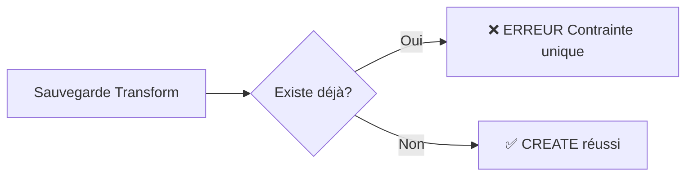
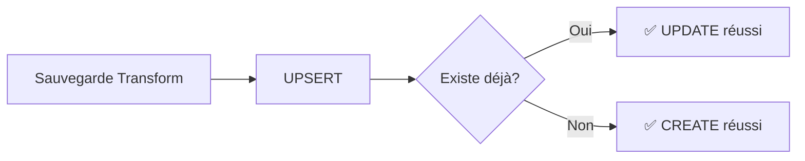

# 🔧 Solution : Design Transforms - Erreur Contrainte Unique

## Problème résolu

**Erreur** : `Unique constraint failed on the fields: (vendorId, vendorProductId, designUrl)`

**Cause** : Le service utilisait `create()` au lieu d'`upsert()` pour sauvegarder les transforms, causant une erreur quand le même transform était sauvegardé plusieurs fois.

**Solution** : Remplacement de `create()` par `upsert()` pour gérer automatiquement les mises à jour et créations.

---

## 🔧 Modifications apportées

### Fichier modifié : `src/vendor-product/vendor-design-transform.service.ts`

**Avant** (ligne ~101) :
```typescript
const result = await this.prisma.vendorDesignTransform.create({
  data: {
    vendorId,
    vendorProductId,
    designUrl,
    transforms,
    lastModified: new Date(lastModified),
  },
});
```

**Après** :
```typescript
const result = await this.prisma.vendorDesignTransform.upsert({
  where: {
    unique_vendor_product_design: {
      vendorId,
      vendorProductId,
      designUrl,
    },
  },
  update: {
    transforms,
    lastModified: new Date(lastModified),
  },
  create: {
    vendorId,
    vendorProductId,
    designUrl,
    transforms,
    lastModified: new Date(lastModified),
  },
});
```

---

## 🔍 Contrainte unique dans Prisma

### Schéma Prisma (`prisma/schema.prisma`)

```prisma
model VendorDesignTransform {
  id              Int      @id @default(autoincrement())
  vendorId        Int
  vendorProductId Int
  designUrl       String   @db.VarChar(500)
  transforms      Json
  lastModified    DateTime @default(now()) @updatedAt
  createdAt       DateTime @default(now())

  vendor          User          @relation(fields: [vendorId], references: [id], onDelete: Cascade)
  vendorProduct   VendorProduct @relation(fields: [vendorProductId], references: [id], onDelete: Cascade)

  @@unique([vendorId, vendorProductId, designUrl], name: "unique_vendor_product_design")
}
```

La contrainte `unique_vendor_product_design` garantit qu'un vendeur ne peut avoir qu'un seul transform par couple (produit, design).

---

## 🚀 Comportement de l'upsert

### Première sauvegarde
- **Action** : `CREATE` - Crée un nouvel enregistrement
- **Résultat** : Transform créé avec ID généré

### Sauvegardes suivantes
- **Action** : `UPDATE` - Met à jour l'enregistrement existant
- **Résultat** : Même ID, données mises à jour

### Avantages
- ✅ Pas d'erreur de contrainte unique
- ✅ Même ID conservé lors des mises à jour
- ✅ Gestion automatique CREATE/UPDATE
- ✅ Atomicité garantie

---

## 🧪 Test de validation

**Fichier** : `test-design-transforms-fix.js`

Le script teste :
1. **Première sauvegarde** : Doit créer un nouveau transform
2. **Seconde sauvegarde** : Doit mettre à jour sans erreur
3. **Troisième sauvegarde** : Doit continuer à mettre à jour
4. **Récupération** : Doit retourner les dernières données

### Exécution
```bash
node test-design-transforms-fix.js
```

### Résultat attendu
```
✅ SUCCÈS: Première sauvegarde réussie
   Transform ID: 9
✅ SUCCÈS: Seconde sauvegarde réussie (upsert)
   Transform ID: 9
   ✅ Pas d'erreur de contrainte unique!
✅ SUCCÈS: Troisième sauvegarde réussie
   Transform ID: 9
   ✅ Contrainte unique bien gérée!
```

---

## 📊 Impact sur l'API

| Endpoint | Changement | Comportement |
|----------|------------|--------------|
| `POST /vendor/design-transforms/save` | ✅ Upsert | Première fois = CREATE, suivantes = UPDATE |
| `GET /vendor/design-transforms/:id` | ✅ Inchangé | Récupération normale |

---

## 🔄 Logique métier

### Avant la correction


### Après la correction


---

## 🛡️ Sécurité

La contrainte unique reste active et protège contre :
- Doublons accidentels
- Corruption de données
- Conflits de concurrence

L'upsert respecte cette contrainte tout en permettant les mises à jour légitimes.

---

**Résultat** : Plus d'erreurs de contrainte unique lors des sauvegardes répétées de transforms. Le système gère automatiquement les créations et mises à jour. 