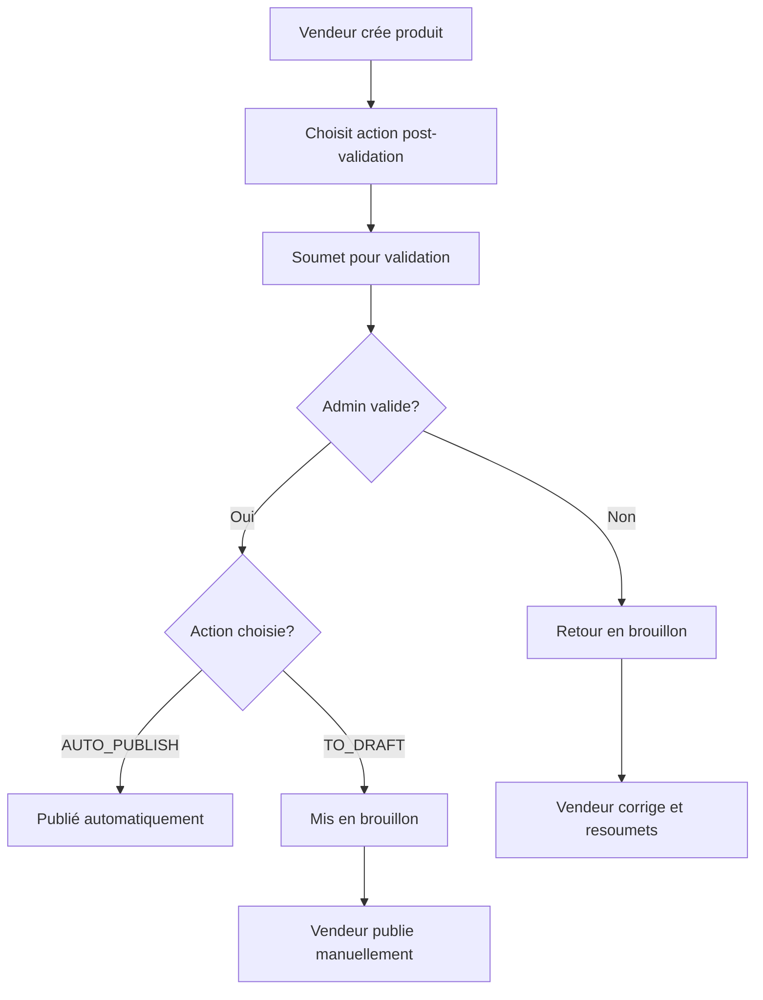

# 📚 RÉFÉRENCE RAPIDE — SYSTÈME CHOIX DE PUBLICATION APRÈS VALIDATION

## 🎯 Résumé
Le vendeur peut maintenant choisir ce qui arrive à son produit après validation admin :
- **`AUTO_PUBLISH`** : Publication automatique ✅
- **`TO_DRAFT`** : Mise en brouillon (publication manuelle) 📝

---

## 🔧 Backend - Nouveaux endpoints

### Vendeur
```http
# Définir le choix de publication
PUT /vendor-product-validation/post-validation-action/:productId
{ "action": "AUTO_PUBLISH" | "TO_DRAFT" }

# Publier manuellement un produit validé en brouillon
POST /vendor-product-validation/publish/:productId
```

### Admin
```http
# Lister les produits en attente avec leur choix
GET /vendor-product-validation/pending

# Valider un produit (applique le choix automatiquement)
POST /vendor-product-validation/validate/:productId
{ "approved": boolean, "rejectionReason"?: string }
```

---

## 🗄️ Base de données - Nouveau champ

```sql
-- Nouveau champ dans VendorProduct
ALTER TABLE "VendorProduct" ADD COLUMN "post_validation_action" "PostValidationAction" NOT NULL DEFAULT 'AUTO_PUBLISH';

-- Nouvel enum
CREATE TYPE "PostValidationAction" AS ENUM ('AUTO_PUBLISH', 'TO_DRAFT');
```

---

## 🎨 Frontend - Composants clés

### 1. Sélecteur de choix
```tsx
<ValidationActionSelector
  productId={product.id}
  currentAction={product.postValidationAction}
  disabled={product.status === 'PENDING'}
  onActionChange={handleActionChange}
/>
```

### 2. Bouton publication manuelle
```tsx
<PublishValidatedProductButton
  productId={product.id}
  productName={product.name}
  onPublished={handlePublished}
/>
```

### 3. Badge de statut
```tsx
<ProductStatusBadge product={product} />
```

---

## 🔄 Workflow complet



---

## 🧪 Tests

```bash
# Lancer le test complet
node test-vendor-validation-choice.js

# Vérifier les endpoints
curl -X PUT http://localhost:3000/vendor-product-validation/post-validation-action/123 \
  -H "Authorization: Bearer TOKEN" \
  -H "Content-Type: application/json" \
  -d '{"action": "TO_DRAFT"}'
```

---

## 🚨 Points d'attention

1. **Modification du choix** : Possible seulement avant validation
2. **Notifications** : Automatiques à chaque étape
3. **Permissions** : Vendeur ne peut publier que ses propres produits validés
4. **Statuts** : `DRAFT` + `isValidated=true` = prêt à publier manuellement

---

## 📋 Checklist d'implémentation

### Backend ✅
- [x] Enum `PostValidationAction` ajouté
- [x] Champ `postValidationAction` dans `VendorProduct`
- [x] Service `VendorProductValidationService` créé
- [x] Contrôleur `VendorProductValidationController` créé
- [x] Endpoints exposés et documentés

### Frontend 🔄
- [ ] Types TypeScript ajoutés
- [ ] Service API créé
- [ ] Hook `useVendorValidation` créé
- [ ] Composants UI créés
- [ ] Intégration dans les pages existantes
- [ ] Tests d'intégration

---

## 🔗 Liens utiles

- **Guide complet** : `FRONTEND_VENDOR_VALIDATION_CHOICE_GUIDE.md`
- **Script de test** : `test-vendor-validation-choice.js`
- **Migration** : `prisma/migrations/20250703232500_add_post_validation_action/`

---

**Le système est prêt côté backend ! 🚀** 
 